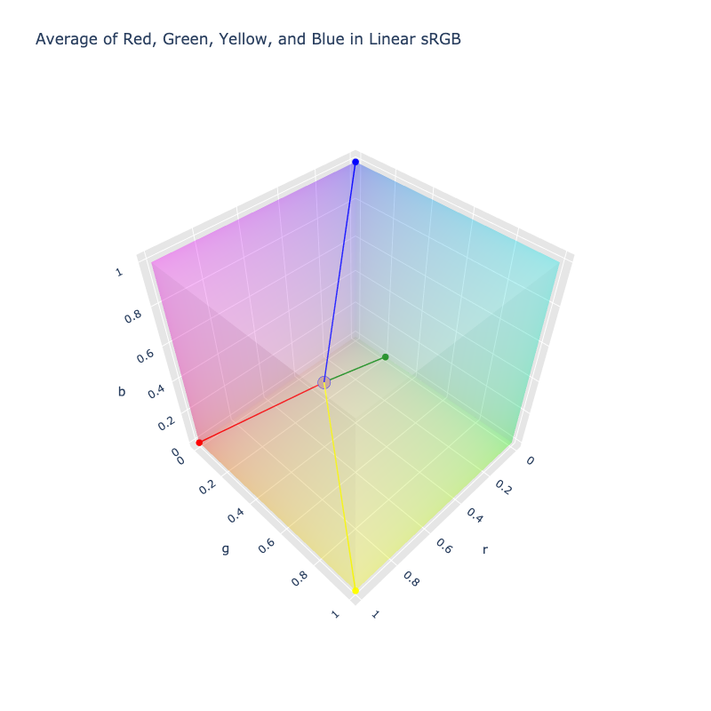

# Color Averaging

Color averaging is the process taking multiple colors and calculating an average color from them, essentially mixing
all the colors together. This involves looking at each color channel of all colors under consideration and averaging
and averaging each channel independently. Additionally, by default, transparency is taken into account by using
premultiplication which weights the colors such that more opaque colors have a greater significance in the mixing vs
more translucent colors.

Averaging under ColorAide can take as many colors as desired and will return a color that represents the average. This
approach to mixing is not to be confused with interpolation which employs a different technique. One thing that sets it
apart from interpolation is that when performing the operation, the order of the colors does not matter and will yield
the same results even if the colors are shuffled.

Averaging can be used as a way to mix multiple colors into one color or simply determine what the overall average color
is from a set of colors. Results are subject to the geometry of the color space in which the average is performed.

## Rectangular Space Averaging

ColorAide, by default, averages colors in the rectangular Linear sRGB color spaces. For most, averaging in rectangular
spaces would most likely be the common approach.



While linear sRGB is the default color space when averaging, other color spaces can be used. Results will vary due to
the geometry of the color space being used.

```py play
Color.average(['red', 'blue'])
Color.average(['red', 'blue'], space='srgb')
Color.average(['red', 'blue'], space='oklab')
```

Averaging can be applied to any amount of colors.

```py play
Color.average(['red', 'yellow', 'orange', 'green'])
```

## Cylindrical Space Averaging

ColorAide can also average colors in cylindrical spaces. When applying averaging in a cylindrical space, hues will be
averaged taking the circular mean. Due the difference in approach, color averaging in a cylindrical space can be quite
different.


To perform averaging in a cylindrical/polar space, simply specify the space when averaging.

```py play
Color.average(['purple', 'green', 'blue'], space='hsl')
```

Colors that are deemed achromatic will have their hue treated as undefined, even if the hue is defined. This is to
ensure that the average color makes sense and isn't tainted by a non-functional hue.

```py play
Color.average(['white', 'blue'], space='hsl')
```

It should be noted that when averaging colors with hues which are evenly distributed around color space, the result
will produce an achromatic hue. When achromatic hues are produced during circular mean, the color will discard
chroma/saturation information, producing an achromatic color.

```py play
Color.average(['red', 'green', 'blue'], space='hsl')
```

## Weighted Averaging

To allow for greater control and nuance of mixing multiple colors, ColorAide allows weights to be defined to adjust how
much a specific color is mixed relative to other colors.

As an example, let's assume we wanted to mix `#!color orange` and `#!color red` but brighten it up with `#!color white`.
More specifically, let's say we want 4 times the amount of white for every 1 part of the other colors. We can simply
specify weights intuitively as `#!py [1, 1, 4]`.


```py play
Color.average(['orange', 'red', 'white'])
Color.average(['orange', 'red', 'white'], [1, 1, 4])
```


Regardless of how big or small the numbers are, they are scaled relative to the largest value, so internally,
`#!py [1, 1, 4]` and `#!py [0.25, 0.25, 1]` are essentially the same.

```py play
Color.average(['orange', 'red', 'white'], [1, 1, 4])
Color.average(['orange', 'red', 'white'], [0.25, 0.25, 1])
```

If more weights are provided that there are colors, the only the weights sufficient to satisfy the number of colors
is consumed.

```py play
Color.average(['orange', 'red', 'white'], [1, 1, 4, 2, 1])
```

If more colors are provided than weights, colors without defined weights are assumed to be full weight.

```py play
Color.average(['orange', 'red', 'white'], [0, 1])
```

/// note
It should be noted that negative weights are not allowed and will be clipped to zero, which treats the colors as if it
is not included at all.
///

## Averaging with Transparency

ColorAide, by default, will account for transparency when averaging colors. Colors which are more transparent will have
less of an impact on the average. This is done by premultiplying the colors before averaging, essentially weighting the
color components where more opaque colors have a greater influence on the average.

```py play
for i in range(12):
    Color.average(
        [f'color(srgb 0 1 0 / {i / 11})', 'color(srgb 0 0 1)']
    )
```

There are cases where this approach of averaging may not be desired and results are desired without considering
transparency. If so, `premultiplied` can be disabled by setting it to `#!py False`. While the average of transparency is
still calculated, it can be discarded from the final result if desired.

It should also be noted that when a color is fully transparent, its color components will be ignored, regardless of the
`premultiplied` parameter, as fully transparent colors provide no meaningful color information.

```py play
for i in range(12):
    Color.average(
        [f'color(srgb 0 1 0 / {i / 11})', 'color(srgb 0 0 1)'],
        premultiplied=False,
    )
```

## Averaging with Undefined Values

When averaging with undefined values, ColorAide will not consider the undefined values in the average. In short, it
will be treated as if there was no value contributing to the average. This is mainly provided for sane averaging of
achromatic colors in cylindrical/polar color spaces. With that said, any channel that has manually specified a channel
as undefined will be treated in this manner.

```py play
Color.average(['white', 'color(srgb 0 0 1)'], space='hsl')
```

When averaging hues in a polar space, implied achromatic hues are also treated as undefined as counting such hues would
distort the average in a non-meaningful way.

```py play
Color.average(['hsl(30 0 100)', 'hsl(240 100 50 / 1)'], space='hsl')
```

As stated earlier, undefined logic is applied to any channel with undefined values. It should be noted that no attempt
to carry forward the undefined values through conversion is made at this time. If conversion is required, the
conversions will remove any undefined status unless the channel is an achromatic hues.

```py play
for i in range(12):
    Color.average(['darkgreen', f'color(srgb 0 none 0 / {i / 11})', 'color(srgb 0 0 1)'])
```

When `premultiplied` is enabled, premultiplication will not be applied to a color if its `alpha` is undefined as it is
unknown how to weight the color. Instead, a color with undefined transparency will be treated with full weight.

```py play
Color.average(['darkgreen', f'color(srgb 0 0.50196 0 / none)', 'color(srgb 0 0 1)'])
```
