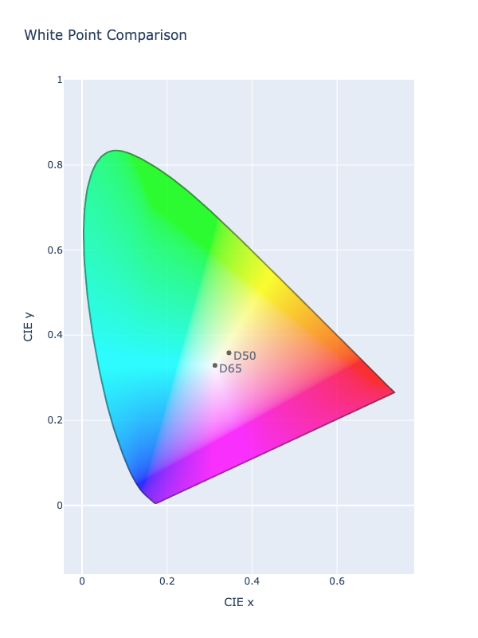

# Chromatic Adaptation

Chromatic adaptation is the human visual system's ability to adjust to changes in illumination in order to preserve the
appearance of object colors. It is responsible for the stable appearance of object colors despite the wide variation of
light which might be reflected from an object and observed by our eyes. A chromatic adaptation transform (CAT) emulates
this important aspect of color perception in color appearance models.

In short, colors look different under different lighting, and CATs are used to predict what a color should look like
from one lighting source to another.

## Illuminants

Viewing a color in daylight will look different than viewing it by candle light. Color spaces usually define a reference
illuminant that clarifies the assumed lighting for the given space. For instance, sRGB is a color space defined with an
illuminant of D65 (light in the shade - no direct sunlight - at noon). On the other hand, the ProPhoto RGB space uses a
D50 illuminant (direct sunlight at noon).



When translating a color from one illuminant to another, it is desirable to ensure that the color under the original
illuminant appears as it should under the new illuminant, just as it would in real life. CATs are used to predict
what the new color under the new illuminant should be in order to fulfill these requirements.

For a quick example, let's take the color `#!color blue` under sRGB (D65 white point) and the same `#!color blue` under
Pro Photo RGB (D50 white point). If we take the raw chromaticity points from the color under each color space and use
them to generate a color, both under the same color space (in this case sRGB), we can see that the values are different.
We can see the values are different.

```py play
d65 = Color('blue').split_chromaticity()
d50 = Color('blue').convert('prophoto-rgb').split_chromaticity()
color_d50 = Color.chromaticity('srgb', d50)
color_d65 = Color.chromaticity('srgb', d65)
Row([color_d50, color_d65])
```

The same color looks different because it is reflecting a different light source. The illuminant of a color space can
affect how the color appears, and each illuminant has a different color temperature which can provide a warmer or cooler
color tone to the colors under a particular color space.

We can visualize this concept a bit more clearly by taking the raw chromaticities from the D50 and D65 `#!color white`
and scaling them both under the same color space. Here we will take both the D50 and D65 white point and first scale
them under the D65 sRGB color space and then scale them under the D50 Pro Photo color space. Notice that the D50 white
(Pro Photo) has a red shift when rendered under sRGB, but the D65 white (sRGB) has a blue shift under Pro Photo.
Relative to each other, the D65 white has a cooler temperature than D50, and this changes the color.

```py play
d65 = Color('srgb', [1, 1, 1]).split_chromaticity()
d50 = Color('prophoto-rgb', [1, 1, 1]).split_chromaticity()
color_d50 = Color.chromaticity('srgb', d50, scale=True)
color_d65 = Color.chromaticity('srgb', d65, scale=True)
Row([color_d50, color_d65])
color_d50 = Color.chromaticity('prophoto-rgb', d50, scale=True)
color_d65 = Color.chromaticity('prophoto-rgb', d65, scale=True)
Row([color_d50, color_d65])
```

In order to account for the differences in illuminants, we use chromatic adaptation to modify the chromaticities of the
color so that that they account for the different illuminant and appear as they should under the new light source. This
happens automatically when we do call `convert()`. We can see that the white point gets adjusted such that the D50 white
looks like the D65 white when in sRGB and D65 white looks like D50 white under Pro Photo.

```py play
color_d50 = Color('prophoto-rgb', [1, 1, 1]).convert('srgb')
color_d65 = Color('srgb', [1, 1, 1])
Row([color_d50, color_d65])
```

Generally, chromatic adaptation takes place within the XYZ color space. So in ColorAide, any color transform that must
account for the differences of illuminants between two color spaces must go through chromatic adaptation, and it must
occur in the XYZ color space. ColorAide satisfies this by making the registration of the XYZ D65 color space mandatory
and using it as the transition color space when chromatic adaptation is needed.

For instance, if a color space such as Pro Photo is being translated to sRGB, Pro Photo will first be transformed to XYZ
D50, then it will be chromatically adapted to XYZ D65, next it will be transformed sRGB.

So, we can actually do this manually and compare the results to `convert()` which automatically handles chromatic
adaptation. In order to do this, we need to provide the specified "white point" for the source color and the "white
point" for the destination color along with the XYZ coordinates we wish to transform. ColorAide uses the Bradford CAT
by default, so we will specify that CAT for consistency.

```py play
from coloraide import cat
xyzd50 = Color('prophoto-rgb', [1, 1, 1]).convert('xyz-d50').coords()
xyzd50
xyzd65 = Color.chromatic_adaptation(cat.WHITES['2deg']["D50"], cat.WHITES['2deg']["D65"], xyzd50, method='bradford')
manual = Color('xyz-d65', xyzd65).convert('srgb')
auto = Color('prophoto-rgb', [1, 1, 1]).convert('srgb')
manual, auto
```

ColorAide, currently defines the following illuminants for both 2˚ observer and 10˚ observer, but most people are
probably only concerned with D65 and D50 (2˚ degree observer) which are the only the illuminants used in the default
color spaces provided by ColorAide. Illuminants are not restricted to what is listed below, but those are the ones
available by default.

Illuminants |
----------- |
`A`         |
`B`         |
`C`         |
`D50`       |
`D55`       |
`D65`       |
`D75`       |
`E`         |
`F2`        |
`F7`        |
`F11`       |

## Supported CATs

There are various CATs, all varying in complexity and accuracy. We will not go through all of them and instead will
leave that up to the user to research as needed. Suffice it to say, the Bradford CAT is currently the industry standard
(in most cases), but there are a variety of options available, and research continues to try and improve upon CATs of
the past to come up with better CATs for the future.

Currently, ColorAide mainly supports von Kries type CATs (named after an early 20th century color scientist), or CATs
that are similar to and/or are built upon the original von Kries CAT. We also do not currently support every known von
Kries CAT out there, but a good number are available. In the future, support may be expanded.

CAT           |
------------- |
`bradford`    |
`von-kries`   |
`xyz-scaling` |
`sharp`       |
`cat02`       |
`cat16`       |
`cmccat97`    |
`cmccat2000`  |

## Changing the Default CAT

Changing the default CAT is easy and follows the same pattern as the rest of the
[available class overrides](./color.md#override-default-settings). Simply derive a new `#!py3 Color()` class from the
original and override the `CHROMATIC_ADAPTATION` property with the [name of the desired CAT](#supported-cats).
Afterwards, all color transforms will use the specified CAT.

```py play
class Custom(Color):
    CHROMATIC_ADAPTATION = 'cat02'

d50 = Custom('color(xyz-d50 0.11627 0.07261 0.23256 / 1)')
d65 = d50.convert('xyz-d65')
d50, d65
```
