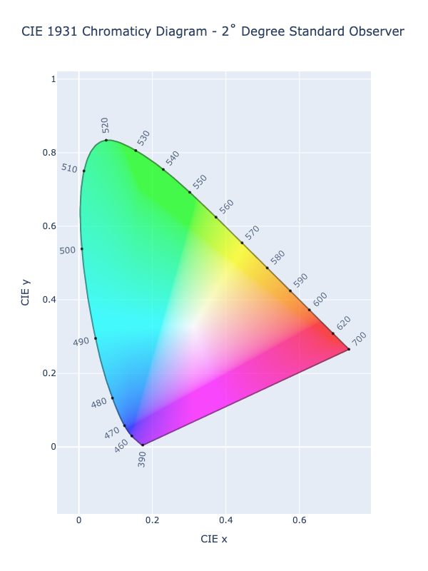
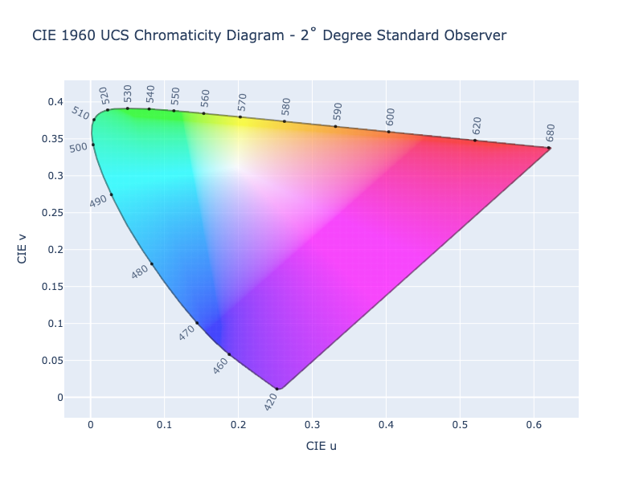
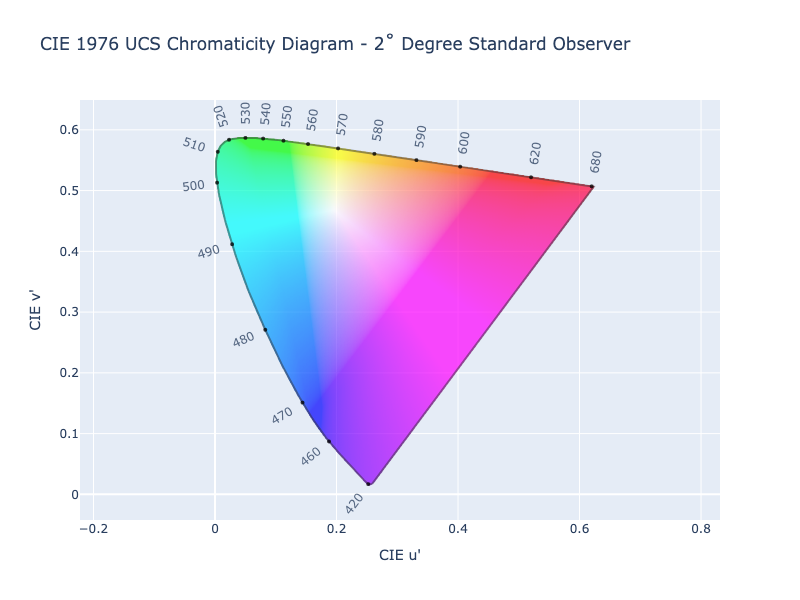
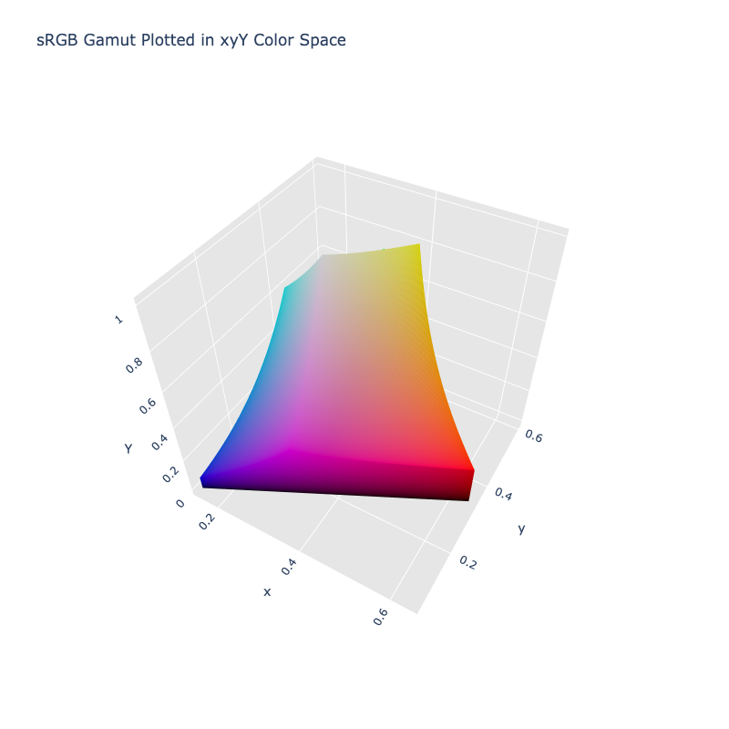

# Chromaticity Coordinates

Colors are generally composed of two parts, luminance and chromaticity. Luminance refers to the brightness while
chromaticity refers to the hue and colorfulness.

Separating out chromaticity from luminance, we can create a 2D from the chromaticity where we are able to plot the full
spectrum of visible color. Over time, there have been multiple approaches to expressing chromaticity, the most common
being: CIE 1931, CIE 1964, or CIE 1976.

/// tab | 1931 xy Chromaticity Diagram

///

/// tab | 1960 uv Chromaticity Diagram

///

/// tab | 1931 u'v' Chromaticity Diagram

///

Chromaticity coordinates are an important part of color science and are often used to define characteristics of color
spaces, including gamuts and white points. This is often why depictions of white points and gamuts are overlaid onto
chromaticity diagrams.


When combined with luminance, we can add depth when viewing a gamut within the chromaticity space.



## Getting Chromaticity Coordinates

ColorAide provides a few  ways to access chromaticity. The first method, `split_chromaticity()`, allows for decomposing
a color into it's two basic parts: chromaticity and luminance. The result is a 3 coordinates list containing the 2D
chromaticity coordinates followed by the luminance. By default, values are exported in the format u'v'Y, where u'v' is
the chromaticity coordinates in the CIE 1976 system and Y is the luminance taken directly from XYZ.


```py play
Color('red').split_chromaticity()
```

If chromaticity coordinates are desired in a different format, any of the following can be manually specified.

Key      | Output      | Description
-------- | ----------- | -----------
`xy-1931`| [x, y, Y]   | Chromaticity in the CIE 1931 xy system and luminance.
`uv-1960`| [u, v, Y]   | Chromaticity in the CIE 1960 uv system and luminance.
`uv-1976`| [u', v', Y] | Chromaticity in the CIE 1976 u'v' system and luminance.

```py play
Color('red').split_chromaticity('xy-1931')
```

All results are returned with chromaticities being relative to the current color's white point. This allows you to get
the true chromaticities of that color space. If a pair of white point chromaticities are provided, the values will be
chromatically adapted to match the given white point. `white` must be specified as an xy chromaticity pair. If you have
chromaticity values in a non-xy pair, see [converting chromaticity coordinates](#converting-chromaticity-coordinates)
to learn how to convert them to the expected format.

```py play
from coloraide import cat
Color('red').split_chromaticity(white=cat.WHITES['2deg']['D50'])
```

/// tip
If you ever need to get the white point from an already registered, supported color space, ColorAide makes these
available via `white()`. The value is returned by default as the tristimulus values (XYZ coordinates), but it can also
be returned as any of the supported chromaticity coordinate formats by specifying the desired output.

```py play
Color('red').white()
Color('red').white('uv-1960')
```
///

If all that is desired is the 2D chromaticity coordinates, you can also use the two, simple convenience methods: `xy()`
and `uv()`. `xy()` will return chromaticity in the CIE 1931 xy system and `uv()` will return chromaticity within the
CIE 1976 u'v' system (default) or the CIE 1960 uv system, uv output is controlled by explicitly passing the desired
year of the uv system.

```py play
Color('red').xy()
Color('red').uv()
Color('red').uv('1960')
```

The `white` parameter is also accepted by `xy()` and `uv()`.

/// tip | Luminance
ColorAide also allows for grabbing luminance via the `luminance()` method. It should be noted that by default this
function returns luminance relative to the D65 white point as it is common for people to use luminance normalized like
this, but if you'd like to quickly get luminance and have it relative to the current color's white point, just set
`white` to `#!py None` and ColorAide will calculate the value relative to the current color.

```py play
Color('red').luminance(white=None)
```
///

/// new | New 2.4
- `split_chromaticity()` is new in 2.4.
- Chromaticity specifier in `white()` is new in 2.4.
- `white` parameter of `luminance()` is new in 2.4.
///

## Create Color From Chromaticity Coordinates

/// new | New 2.4
///

ColorAide also provides an easy way to create colors from chromaticity coordinates. `chromaticity()` is a generalized
method that takes a color space to create the color in and a set of chromaticity coordinates. The coordinates should be
supplied using the same white point as the targeted color space. Chromaticity coordinates can be passed as 2D
coordinates without luminance or with luminance. When passed with luminance the color should be identical to the
original.

```py play
uvY = Color('red').uv()
Color.chromaticity('srgb', uvY)
```

If only 2D chromaticity points are given, Y will be assumed as 1. When luminance is maxed out like this, it may be
desirable to normalize/scale the color in a linear RGB space to make the color displayable. This can be done by enabling
`scale` which, by default, scales the color in linear sRGB. If a wider gamut is needed, you can change it via 
`scale_space`. Using a non-linear RGB space is not recommended as non-linear spaces will cause the chromaticity
coordinates to shift.

```py play
uv = Color('red').uv()
Color.chromaticity('srgb', uv, scale=True)
uv = Color('display-p3', [1, 0, 0]).uv()
Color.chromaticity('display-p3', uv, scale=True, scale_space='display-p3-linear')
```

This generally preserves chromaticity, scaling luminance, but if a color is out of gamut, the chromaticity of the
resultant color will be affected.

/// tip
There is no RGB color space that perfectly encompasses the entire visible gamut. No matter what scaling space is
selected, colors outside the gamut of the scaling space will not exactly match the specified chromaticity coordinates.
If exact values are needed, scaling should be avoided. If displaying the colors is desired, then sacrificing accuracy
of the colors by scaling or some other gamut mapping method is necessary. Scaling/normalization is how we colorize all
of our chromaticity diagrams in these documents.
///

It is important to be consistent with white point usage. If we wanted to create a color in sRGB with ProPhoto
chromaticities, it is important that we create the color first under a color space that uses the same white point.
ProPhoto uses D50 and sRGB uses D65. So if we had ProPhoto chromaticities, it makes sense to first create the color
under ProPhoto and then convert to sRGB.

```py play
c1 = Color('prophoto-rgb', [1, 0, 0])
c2 = Color.chromaticity('prophoto-rgb', c1.split_chromaticity()).convert('srgb')
c1, c2.convert('prophoto-rgb')
```

With that said, there may be times when you have chromaticity coordinates that use a white point which no current
supported color space supports. `chromaticity()` does provide a way of gamut mapping such coordinates by simply
specifying the white point of the provided chromaticity coordinates. To illustrate, we'll take the same example, but
this time create a color under sRGB directly with ProPhoto chromaticities, the difference is that we will pass
ProPhoto's white point.

```py play
c1 = Color('prophoto-rgb', [1, 0, 0])
c2 = Color.chromaticity('srgb', c1.split_chromaticity(), white=c1.white('xy-1931'))
c1, c2.convert('prophoto-rgb')
```

## Converting Chromaticity Coordinates

/// new | New 2.4
///

ColorAide normally expects you are working with chromaticity points that are compatible with at least one of the
registered color spaces. In general, the API is set up with this expectation to make things easy for users. Normally,
the user will not need to manually specify a white point, but it is possible that a user may be working with or
exporting chromaticity coordinates to/from an unsupported, external space using an altogether different white point.
We may need to specify that white point, but it may be in a format that ColorAide doesn't expect. Luckily, ColorAide
provides a simple way to convert from between various chromaticity formats and convert to and from tristimulus (XYZ)
values.

```py play
from coloraide import util
Color('white').xy()
Color.convert_chromaticity('uv-1976', 'xy-1931', Color('white').uv())
Color.convert_chromaticity('uv-1960', 'xy-1931', Color('white').uv('1960'))
Color.convert_chromaticity('xyz', 'xy-1931', Color('white').convert('xyz-d65').coords())
```

/// tip
When converting from XYZ tristimulus values to chromaticity values, the color `#!color black` resolves to `[0, 0]` in
xy, uv, or u'v'. This does not align with other achromatic values within the color space if displaying in 3D. This
isn't technically incorrect as any chromaticity pair with zero luminance will be equal to `#!color black` in XYZ.
ColorAide normally accounts for this and aligns the point using the targeted color's white point, but when manually
converting using `convert_chromaticity()`, such context is unavailable. If you are converting external XYZ values to
chromaticity coordinates and would like to align, `#!color black` on the achromatic axis, simply pass in the white point
for context.

```py play
black = Color('black')
black.xy()
Color.convert_chromaticity('xyz', 'xy-1931', black.convert('xyz-d65').coords())
Color.convert_chromaticity('xyz', 'xy-1931', black.convert('xyz-d65').coords(), white=black.white('xy-1931'))
```
///
