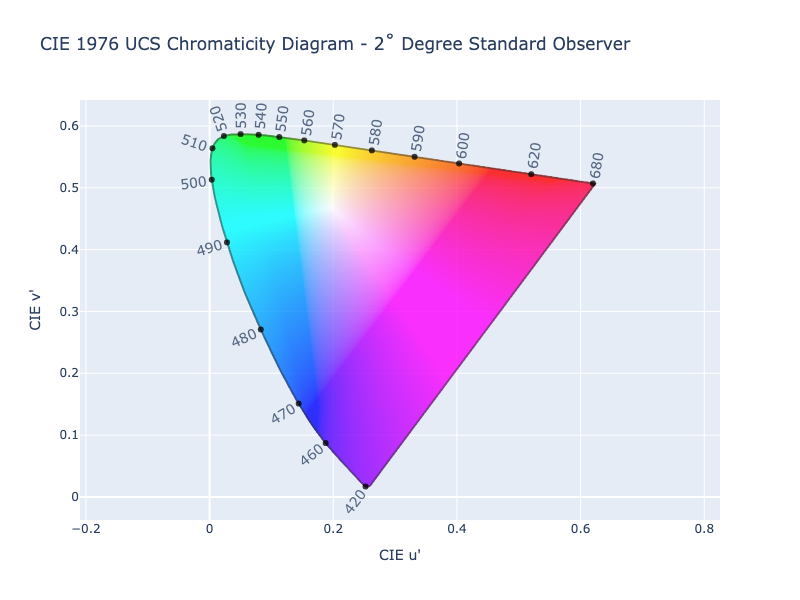

# Chromaticity Coordinates

In color science, the white point of an illuminant or of a display is a neutral reference characterized by a
chromaticity; all other chromaticities may be defined in relation to this reference. Often, when speaking about
chromaticity coordinates, we are talking about coordinates in one of the CIE chromaticity spaces like 1931 xy, 1960 uv,
or 1976 u'v'.

These coordinates are often use to represent all visible coordinates in what is called chromaticity diagrams. Over time,
their have been updates to how these points are represented, the 1931 xy being the first and the 1976 u'v' being the
latest. Even with newer and better models, you will still often see the 1931 xy diagram being used to display the
visible spectrum and gamuts of color spaces within it.

/// tab | 1931 xy Chromaticity Diagram

///

/// tab | 1960 uv Chromaticity Diagram

///

/// tab | 1931 u'v' Chromaticity Diagram

///

Color spaces are often defined by their chromaticity points. For instance, the sRGB color spaces defines their gamut
using chromaticity coordinates for the R, G, B channels. Additionally, it's D65 white point is defined by chromaticity
coordinates as well.


A color's chromaticity coordinates can be calculated directly from the XYZ tristimulus and are relative to that XYZ
space's white point.

## Getting Chromaticity Coordinates

To get the chromaticity points for a color, you simply need to convert that color to one of these chromaticity spaces.
If we wanted xy coordinates, converting to the xyY color space and retrieving the xy values is all that is needed.

While ColorAide does provide an [xyY color space](./colors/xyy.md), it is specifically relative to the D65 white point,
and so chromaticity coordinates acquired from it would only be accurate for spaces that use the D65 white point.

To make calculating the chromaticity coordinates for colors easy, ColorAide provides a few methods: `xy()`, `uv()`, and
`get_chromaticity()`. These methods will return the chromaticity coordinates relative the current color space's white
point.

If all you care about is getting the 2D chromaticity coordinates, you can quickly acquire these by using `xy()` or
`uv()`. As there are a couple variations of uv, u'v' being the other, `uv()` takes a parameter to control what form the
uv coordinates are returned as: `1960` or `1976` (the default).

```py play
Color('red').uv('1976')
Color('red').uv('1960')
Color('red').xy()
```

In chromaticity diagrams the luminance is discarded, but if preserving the luminance is desired, the general purpose
`get_chromaticity()` method is a better choice. By specifying the mode, you can return the coordinates as xyY, uvY, and
u'v'Y, Y being the luminance. You can specify which form of chromaticity you want by specifying one of the accepted
modes: `xy-1931`, `uv-1960`, and `uv-1976` (the default).

```py play
Color('red').get_chromaticity()
Color('red').get_chromaticity('uv-1960')
Color('red').get_chromaticity('xy-1931')
```

If a set of white point chromaticities are provided, the values will be chromatically adapted to match the given white
point.

```py play
from coloraide import cat
Color('red').get_chromaticity(white=cat.WHITES['2deg']['D50'])
```

## Create Color From Chromaticity Coordinates

ColorAide also provides an easy way to go from chromaticity coordinates to a color space of your choice.
`chromaticity()` is a generalized method that takes a color space to convert to and a set of chromaticity coordinates.
The chromaticity coordinates should be supplied using the same white point as the target color space.

```py play
uvY = Color('red').get_chromaticity()
Color.chromaticity('srgb', uvY)
```
If only given 2D chromaticity points, Y will be assumed as 1.

```py play
uv = Color('red').uv()
Color.chromaticity('srgb', uv)
```

If the chromaticity points are provided with a different white point than the targeted color space, you can provide
the white chromaticity points for the chromaticity coordinates to force a proper translation.

```py play
from coloraide import cat
c1 = Color('prophoto-rgb', [1, 0, 0])
uv = c1.get_chromaticity()
c2 = Color.chromaticity('srgb', uv, white=cat.WHITES['2deg']['D50'])
c1, c2.convert('prophoto-rgb')
```
