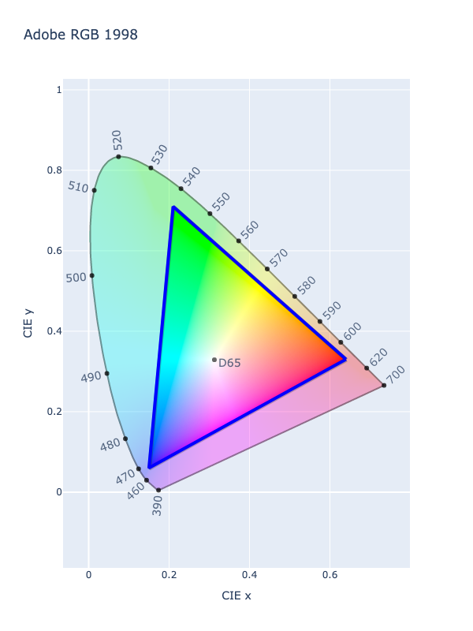

# Linear A98 RGB

!!! success "The Linear A98 RGB color space is registered in `Color` by default"

<div class="info-container" markdown>

!!! info inline end "Properties"

    **Name:** `a98-rgb-linear`

    **White Point:** D65

    **Coordinates:**

    Name | Range^\*^
    ---- | -----
    `r`  | [0, 1]
    `g`  | [0, 1]
    `b`  | [0, 1]

    ^\*^ Range denotes _in gamut_ colors, but the color space supports an extended range beyond the gamut.

<figure markdown>



<figcaption markdown>
CIE 1931 xy Chromaticity -- Adobe(r) RGB 1998 Chromaticities
</figcaption>
</figure>

The Linear A98 RGB space is the same as [A98 RGB](./a98_rgb.md) *except* that the transfer function is linear-light
(there is no gamma-encoding).

_[Learn about A98 RGB](https://en.wikipedia.org/wiki/Adobe_RGB_color_space)_
</div>

## Channel Aliases

Channels | Aliases
-------- | -------
`r`      | `red`
`g`      | `green`
`b`      | `blue`

## Input/Output

Linear A98 RGB is not supported via the CSS spec and the parser input and string output only supports the
`#!css-color color()` function format using the custom name `#!css-color --a98-rgb-linear`:

```css-color
color(--a98-rgb-linear r g b / a)  // Color function
```

When manually creating a color via raw data or specifying a color space as a parameter in a function, the color
space name is always used:

```py
Color("a98-rgb-linear", [0, 0, 0], 1)
```

The string representation of the color object and the default string output will be in the
`#!css-color color(--a98-rgb-linear r g b / a)` form.

```playground
Color("a98-rgb", [0.71513, 0, 0])
Color("a98-rgb-linear", [0.82231, 0.37626, 0.01549]).to_string()
```

## Registering

```py
from coloraide import Color as Base
from coloraide.spaces.a98_rgb_linear import A98RGBLinear

class Color(Base): ...

Color.register(A98RGBLinear())
```
