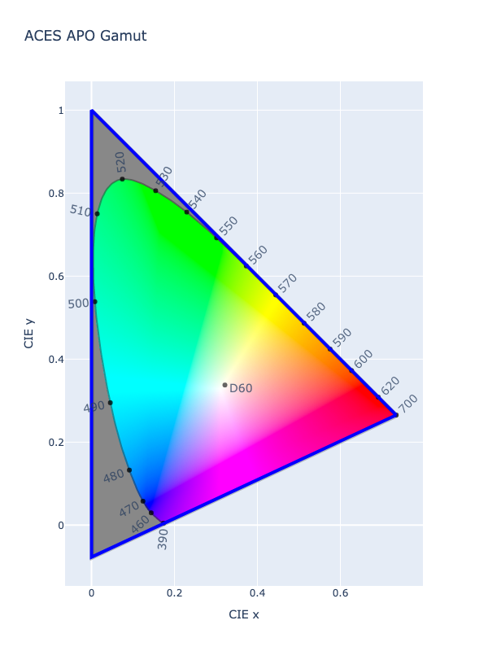

# ACES 2065-1

/// failure | The ACES 2065-1 color space is not registered in `Color` by default
///

/// html | div.info-container
//// info | Properties
    attrs: {class: inline end}

**Name:** `aces2065-1`

**White Point:** D60

**Coordinates:**

Name | Range
---- | -----
`r`  | [0, 65504]
`g`  | [0, 65504]
`b`  | [0, 65504]
////

//// html | figure


///// html | figcaption
CIE 1931 xy Chromaticity -- ACES AP0 Chromaticities
/////
////

ACES 2065-1 is a linear color space that uses a set of primaries known as AP0 and has the widest gamut of all the ACES
color spaces and fully encompasses the entire visible spectrum. It is meant primarily as an archival format due to its
ability to encapsulate all visible colors. Typically, this is the color space you would use to transfer
images/animations between production studios.

While it is considered an RGB color space, it also has enormous dynamic range with channels being able to well exceed
the traditional range of 1.

_[Learn about ACES 2065-1](https://docs.acescentral.com/#aces-2065-1)_

///

## Channel Aliases

Channels | Aliases
-------- | -------
`r`      | `red`
`g`      | `green`
`b`      | `blue`

## Input/Output

ACES 2065-1 is not supported via the CSS spec and the parser input and string output only supports the
`#!css-color color()` function format using the custom name `#!css-color --aces2065-1`:

```css-color
color(--aces2065-1 r g b / a)  // Color function
```

When manually creating a color via raw data or specifying a color space as a parameter in a function, the color
space name is always used:

```py
Color("aces2065-1", [0, 0, 0], 1)
```

The string representation of the color object and the default string output will be in the
`#!css-color color(--aces2065-1 r g b / a)` form.

```py play
Color("aces2065-1", [0.43963, 0.08978, 0.01754])
Color("aces2065-1", [0.58374, 0.39584, 0.05951]).to_string()
```

## Registering

```py
from coloraide import Color as Base
from coloraide.spaces.aces2065_1 import ACES20651

class Color(Base): ...

Color.register(ACES20651())
```
