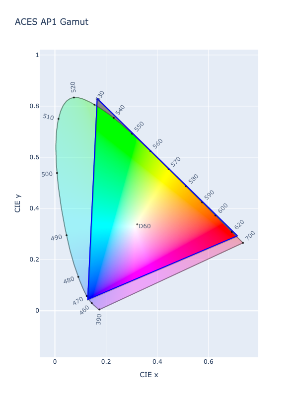

# ACEScg

!!! failure "The ACEScg color space is not registered in `Color` by default"

<div class="info-container" markdown>
!!! info inline end "Properties"

    **Name:** `acescg`

    **White Point:** D60

    **Coordinates:**

    Name | Range
    ---- | -----
    `r`  | [0, 65504]
    `g`  | [0, 65504]
    `b`  | [0, 65504]

<figure markdown>



<figcaption markdown>
CIE 1931 xy Chromaticity -- ACES AP1 Chromaticities
</figcaption>
</figure>

ACEScg is a color space often used by CG artists. It is "scene-referred" or linear. It doesn't have as wide a color
gamut as [ACES 2065-1](./aces2065_1.md) as it uses a different set of primaries called AP1, but it is far larger than
most other color spaces one might use and has an enormous dynamic range.

_[Learn about ACEScg](https://docs.acescentral.com/specifications/acescg/)_

</div>

## Channel Aliases

Channels | Aliases
-------- | -------
`r`      | `red`
`g`      | `green`
`b`      | `blue`

## Input/Output

ACEScg is not supported via the CSS spec and the parser input and string output only supports the
`#!css-color color()` function format using the custom name `#!css-color --acescg`:

```css-color
color(--acescg r g b / a)  // Color function
```

When manually creating a color via raw data or specifying a color space as a parameter in a function, the color
space name is always used:

```py
Color("acescg", [1, 0, 0], 1)
```

The string representation of the color object and the default string output will be in the
`#!css-color color(--acescg r g b / a)` form.

```playground
Color("acescg", [0.6131, 0.07019, 0.02062])
Color("acescg", [0.74085, 0.41498, 0.06184]).to_string()
```

## Registering

```py
from coloraide import Color as Base
from coloraide.spaces.acescg import ACEScg

class Color(Base): ...

Color.register(ACEScg())
```
