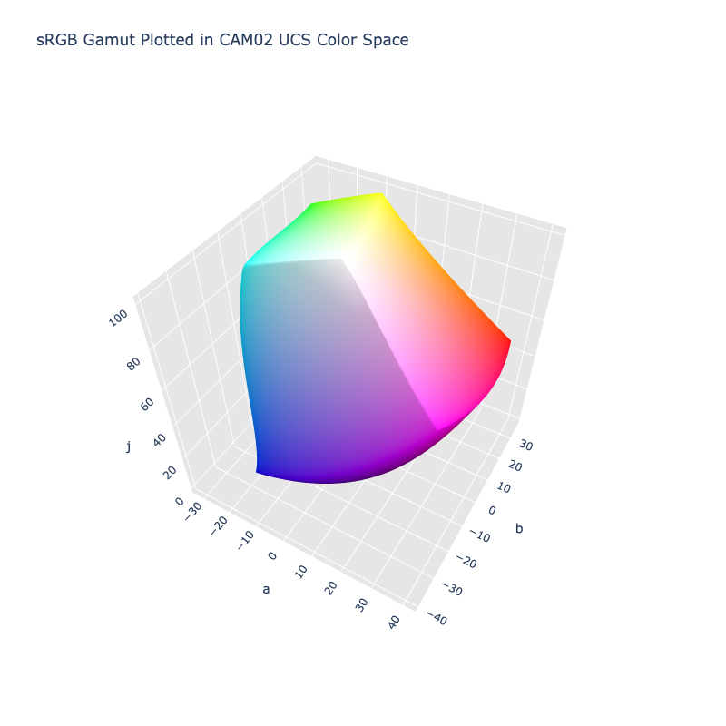

# CAM02 UCS

/// failure | The CAM02 UCS color space is not registered in `Color` by default
///

/// html | div.info-container
//// info | Properties
    attrs: {class: inline end}

**Name:** `cam02-ucs`

**White Point:** D65 / 2˚

**Coordinates:**

Name | Range^\*^
---- | -----
`j`  | [0, 100]
`a`  | [-50, 50]
`b`  | [-50, 50]

^\*^ Space is not bound to the range and is only used as a reference to define percentage inputs/outputs in
relation to the Display P3 color space.
////


//// figure-caption
The sRGB gamut represented within the CAM02 UCS color space.
////

The CAM02 UCS space takes the [CAM02](./cam02.md) model and applies an additional nonlinear transformation to lightness
and colorfulness so that a color difference metric ΔE can be based more closely on Euclidean distance. The `cam02-ucd`
color space in ColorAide is based off CAM02 (Jab) which uses M (colorfulness) to derive the a and b values. There are
also [SCD](./cam02_scd.md) and [LCD](./cam02_lcd.md) variants which optimize the spaces for "small" and "large" color
distancing respectively.

[Learn more](https://www.researchgate.net/publication/221501922_The_CIECAM02_color_appearance_model).
///

## Viewing Conditions

CAM02 UCS uses the same environment setup for viewing conditions as [CAM02 JMh](./cam02.md), so check out the
related documentation if creating a CAM02 UCS variant is desired.

## Channel Aliases

Channels | Aliases
-------- | -------
`j`      | `lightness`
`a`      |
`b`      |

## Input/Output

The CAM02 UCS space is not currently supported in the CSS spec, the parsed input and string output formats use
the `#!css-color color()` function format using the custom name `#!css-color --cam02-ucs`:

```css-color
color(--cam02-ucs j a b / a)  // Color function
```

The string representation of the color object and the default string output use the
`#!css-color color(--cam02-ucs j a b / a)` form.

```py play
Color("cam02-ucs", [60.054, 38.679, 24.316], 1)
Color("cam02-ucs", [79.041, 9.9159, 31.18], 1).to_string()
```

## Registering

```py
from coloraide import Color as Base
from coloraide.spaces.cam02_ucs import CAM02UCS

class Color(Base): ...

Color.register(CAM02UCS())
```
