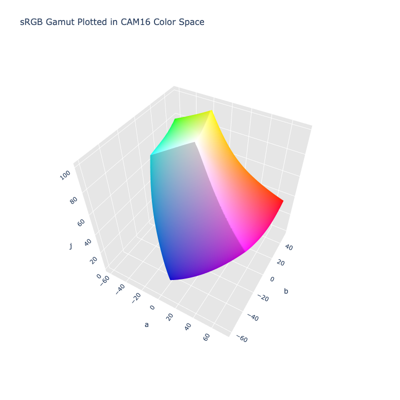

# CAM16

/// failure | The CAM16 color space is not registered in `Color` by default
///

/// html | div.info-container
//// info | Properties
    attrs: {class: inline end}

**Name:** `cam16`

**White Point:** D65

**Coordinates:**

Name | Range^\*^
---- | -----
`j`  | [0, 100]
`a`  | [-90, 90]
`b`  | [-90, 90]

^\*^ Space is not bound to the range and is only used as a reference to define percentage inputs/outputs in
relation to the Display P3 color space.
////

//// html | figure


///// html | figcaption
The sRGB gamut represented within the CAM16 color space.
/////
////

A color appearance model (CAM) is a mathematical model that seeks to describe the perceptual aspects of human color
vision, i.e. viewing conditions under which the appearance of a color does not tally with the corresponding physical
measurement of the stimulus source.

CAM16 is a successor of CIECAM02 with various fixes and improvements. The model actually defines numerous different
attributes:

Name | Description
---- | -----------
J    | Lightness
C    | Chroma
h    | hue
s    | saturation
Q    | Brightness
M    | Colorfulness
H    | Hue Quadrature

A color space can be constructed of using a subset of these attributes: JCh, JMh, Jsh, QCh, QMh, Qsh, etc. You can also
construct Lab like spaces taking using the hue and either C, M, or s. The `cam16` color space in ColorAide represents
a Jab configuration based off M (Colorfulness).

[Learn more](https://doi.org/10.1002/col.22131).
///

## Channel Aliases

Channels | Aliases
-------- | -------
`j`      | `lightness`
`a`      |
`b`      |

## Input/Output

The CAM16 UCS space is not currently supported in the CSS spec, the parsed input and string output formats use
the `#!css-color color()` function format using the custom name `#!css-color --cam16`:

```css-color
color(--cam16 j a b / a)  // Color function
```

The string representation of the color object and the default string output use the
`#!css-color color(--cam16 j a b / a)` form.

```py play
Color("cam16", [46.026, 72.143, 37.385], 1)
Color("cam16", [68.056, 13.955, 41.212], 1).to_string()
```

## Registering

```py
from coloraide import Color as Base
from coloraide_extras.spaces.cam16 import CAM16

class Color(Base): ...

Color.register(CAM16())
```
