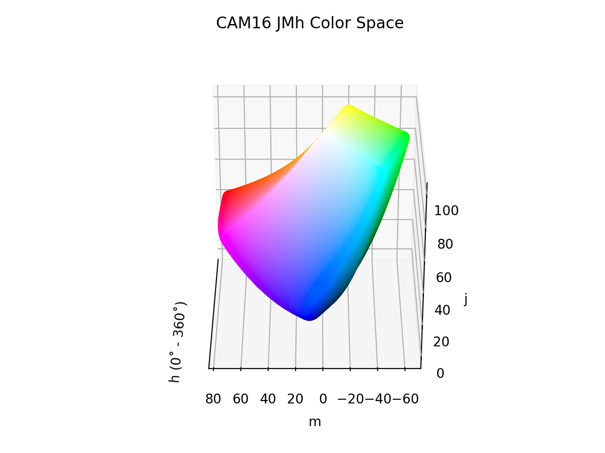

# CAM16 JMh

!!! failure "The CAM16 JMh color space is not registered in `Color` by default"

<div class="info-container" markdown="1">
!!! info inline end "Properties"

    **Name:** `cam16-jmh`

    **White Point:** D65

    **Coordinates:**

    Name | Range^\*^
    ---- | -----
    `j`  | [0, 100]
    `m`  | [0, 105]
    `h`  | [0, 360)

    ^\*^ Space is not bound to the range and is only used as a reference to define percentage inputs/outputs in
    relation to the Display P3 color space.

<figure markdown>



<figcaption markdown>
The sRGB gamut represented within the CAM16 JMh color space.
</figcaption>
</figure>

A color appearance model (CAM) is a mathematical model that seeks to describe the perceptual aspects of human color
vision, i.e. viewing conditions under which the appearance of a color does not tally with the corresponding physical
measurement of the stimulus source.

[CAM16](./cam16.md) is a successor of CIECAM02 with various fixes and improvements. The model actually defines numerous
different attributes:

Name | Description
---- | -----------
J    | Lightness
C    | Chroma
h    | hue
s    | saturation
Q    | Brightness
M    | Colorfulness
H    | Hue Quadrature

A color space can be constructed of using a subset of these attributes: JCh, JMh, Jsh, QCh, QMh, Qsh, etc. You can also
construct Lab like spaces taking using the hue and either C, M, or s. The `cam16-jmh` color space in ColorAide
represents the JMh configuration.

[Learn more](https://doi.org/10.1002/col.22131).
</div>

## Channel Aliases

Channels | Aliases
-------- | -------
`j`      | `lightness`
`m`      | `colorfulness`
`h`      | `hue`

## Input/Output

The CAM16 JMh space is not currently supported in the CSS spec, the parsed input and string output formats use
the `#!css-color color()` function format using the custom name `#!css-color --cam16-jmh`:

```css-color
color(--cam16-jmh j m h / a)  // Color function
```

The string representation of the color object and the default string output use the
`#!css-color color(--cam16-jmh j m h / a)` form.

```playground
Color("cam16-jmh", [59.178, 40.82, 21.153], 1)
Color("cam16-jmh", [78.364, 9.6945, 28.629], 1).to_string()
```

## Registering

```py
from coloraide import Color as Base
from coloraide_extras.spaces.cam16_jmh import CAM16JMh

class Color(Base): ...

Color.register(CAM16JMh())
```

<style>
.info-container {display: inline-block;}
</style>

## Subclassing

CAM16 JMh is a color model that can vary due to viewing conditions. Factors such as surround (average/dim/dark),
adapting luminance, background luminance, white point, and whether the eye is assumed to be fully adapted to the
illuminant can all play into how the color model responds.

If it is desired to create a CAM16 JMh that uses different viewing conditions, the `CAM16JMh` class can be subclassed.
A new `Environment` object should be set to the class describing the viewing conditions. As CAM16 JMh directly uses
the CAM16 (Jab) color space as its base for conversion, that base would also need to be subclassed with the correct
environment, or the the CAM16 JMh class would need to make the transform directly from XYZ. All the helper functions are
available to pull this off if needed.

Additionally, CAM16 JMh requires an `Achromatic` object that is responsible for determining at what point a color with
a given lightness becomes achromatic. Knowing when a color becomes achromatic is important when interpolating in order
to provide the best results. If the viewing conditions are tweaked via `Environment` the `Achromatic` object may require
tuning.

When subclassing, always use a new, unique name, like `cam16-custom` as other features or color spaces may depend on the
`cam16-jmh` name converting a certain way.

You can check out the source to learn more.
