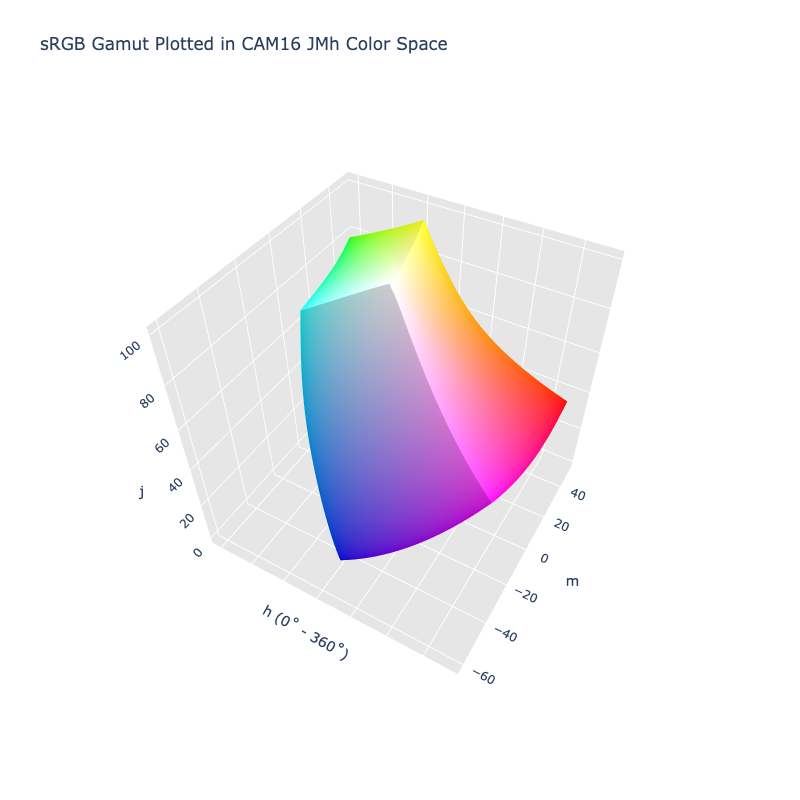

# CAM16 JMh

/// failure | The CAM16 JMh color space is not registered in `Color` by default
///

/// html | div.info-container
//// info | Properties
    attrs: {class: inline end}

**Name:** `cam16-jmh`

**White Point:** D65

**Coordinates:**

Name | Range^\*^
---- | -----
`j`  | [0, 100]
`m`  | [0, 105]
`h`  | [0, 360)

^\*^ Space is not bound to the range and is only used as a reference to define percentage inputs/outputs in
relation to the Display P3 color space.
////

//// html | figure


///// html | figcaption
The sRGB gamut represented within the CAM16 JMh color space.
/////
////

A color appearance model (CAM) is a mathematical model that seeks to describe the perceptual aspects of human color
vision, i.e. viewing conditions under which the appearance of a color does not tally with the corresponding physical
measurement of the stimulus source.

[CAM16](./cam16.md) is a successor of CIECAM02 with various fixes and improvements. The model actually defines numerous
different attributes:

Name | Description
---- | -----------
J    | Lightness
C    | Chroma
h    | hue
s    | saturation
Q    | Brightness
M    | Colorfulness
H    | Hue Quadrature

A color space can be constructed of using a subset of these attributes: JCh, JMh, Jsh, QCh, QMh, Qsh, etc. You can also
construct Lab like spaces taking using the hue and either C, M, or s. The `cam16-jmh` color space in ColorAide
represents the JMh configuration.

[Learn more](https://doi.org/10.1002/col.22131).
///

## Channel Aliases

Channels | Aliases
-------- | -------
`j`      | `lightness`
`m`      | `colorfulness`
`h`      | `hue`

## Input/Output

The CAM16 JMh space is not currently supported in the CSS spec, the parsed input and string output formats use
the `#!css-color color()` function format using the custom name `#!css-color --cam16-jmh`:

```css-color
color(--cam16-jmh j m h / a)  // Color function
```

The string representation of the color object and the default string output use the
`#!css-color color(--cam16-jmh j m h / a)` form.

```py play
Color("cam16-jmh", [59.178, 40.82, 21.153], 1)
Color("cam16-jmh", [78.364, 9.6945, 28.629], 1).to_string()
```

## Registering

```py
from coloraide import Color as Base
from coloraide_extras.spaces.cam16_jmh import CAM16JMh

class Color(Base): ...

Color.register(CAM16JMh())
```
