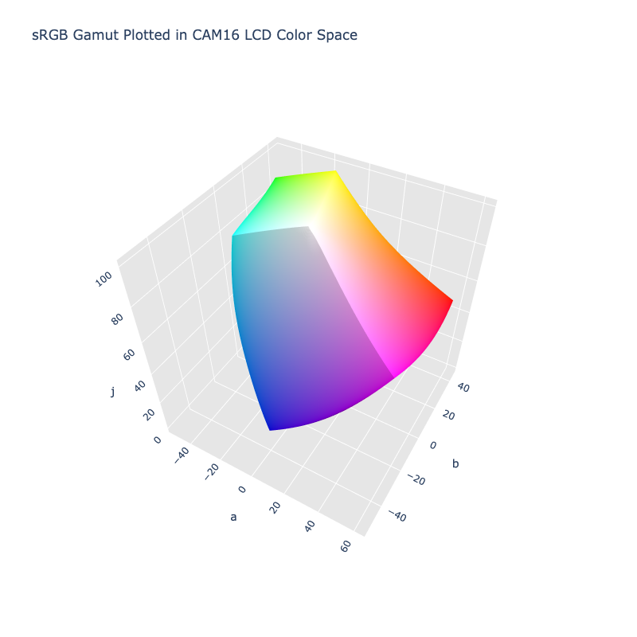

# CAM16 LCD

/// failure | The CAM16 LCD color space is not registered in `Color` by default
///

/// html | div.info-container
//// info | Properties
    attrs: {class: inline end}

**Name:** `cam16-lcd`

**White Point:** D65 / 2˚

**Coordinates:**

Name | Range^\*^
---- | -----
`j`  | [0, 100]
`a`  | [-75, 75]
`b`  | [-75, 75]

^\*^ Space is not bound to the range and is only used as a reference to define percentage inputs/outputs in
relation to the Display P3 color space.
////


//// figure-caption
The sRGB gamut represented within the CAM16 LCD color space.
////

This is the LCD variant of the CAM16 UCS color space and is optimized for "large" color distancing. See
[CAM16 UCS](./cam16_ucs.md) for more info.

[Learn more](https://www.researchgate.net/publication/318152296_Comprehensive_color_solutions_CAM16_CAT16_and_CAM16-UCS).
///

## Viewing Conditions

CAM16 LCD uses the same environment setup for viewing conditions as [CAM16 JMh](./cam16.md), so check out the
related documentation if creating a CAM16 LCD variant is desired.

## Channel Aliases

Channels | Aliases
-------- | -------
`j`      | `lightness`
`a`      |
`b`      |

## Input/Output

The CAM16 LCD space is not currently supported in the CSS spec, the parsed input and string output formats use
the `#!css-color color()` function format using the custom name `#!css-color --cam16-lcd`:

```css-color
color(--cam16-lcd j a b / a)  // Color function
```

The string representation of the color object and the default string output use the
`#!css-color color(--cam16-lcd j a b / a)` form.

```py play
Color("cam16-lcd", [46.026, 81.254, 27.393], 1)
Color("cam16-lcd", [68.056, 43.51, 71.293], 1).to_string()
```

## Registering

```py
from coloraide import Color as Base
from coloraide.spaces.cam16_ucs import CAM16LCD

class Color(Base): ...

Color.register(CAM16LCD())
```
