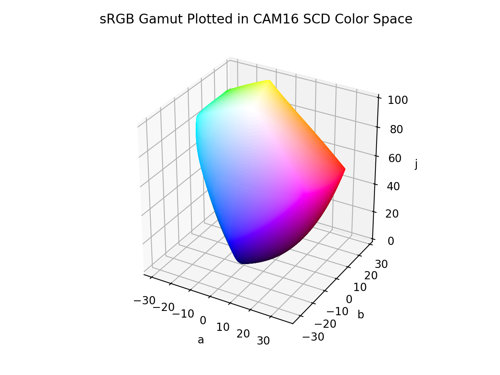

# CAM16 SCD

/// failure | The CAM16 SCD color space is not registered in `Color` by default
///

/// html | div.info-container
//// info | Properties
    attrs: {class: inline end}

**Name:** `cam16-scd`

**White Point:** D65

**Coordinates:**

Name | Range^\*^
---- | -----
`j`  | [0, 100]
`a`  | [-40, 40]
`b`  | [-40, 40]

^\*^ Space is not bound to the range and is only used as a reference to define percentage inputs/outputs in
relation to the Display P3 color space.
////

//// html | figure


///// html | figcaption
The sRGB gamut represented within the CAM16 SCD color space.
/////
////

This is the SCD variant of the CAM16 UCS color space and is optimized for "small" color distancing. See
[CAM16 UCS](./cam16_ucs.md) for more info.

[Learn more](https://doi.org/10.1002/col.22131).
///

## Channel Aliases

Channels | Aliases
-------- | -------
`j`      | `lightness`
`a`      |
`b`      |

## Input/Output

The CAM16 SCD space is not currently supported in the CSS spec, the parsed input and string output formats use
the `#!css-color color()` function format using the custom name `#!css-color --cam16-scd`:

```css-color
color(--cam16-scd j a b / a)  // Color function
```

The string representation of the color object and the default string output use the
`#!css-color color(--cam16-scd j a b / a)` form.

```py play
Color("cam16-scd", [59.178, 33.597, 17.41], 1)
Color("cam16-scd", [78.364, 8.3723, 24.725], 1).to_string()
```

## Registering

```py
from coloraide import Color as Base
from coloraide_extras.spaces.cam16_ucs import CAM16SCD

class Color(Base): ...

Color.register(CAM16SCD())
```
