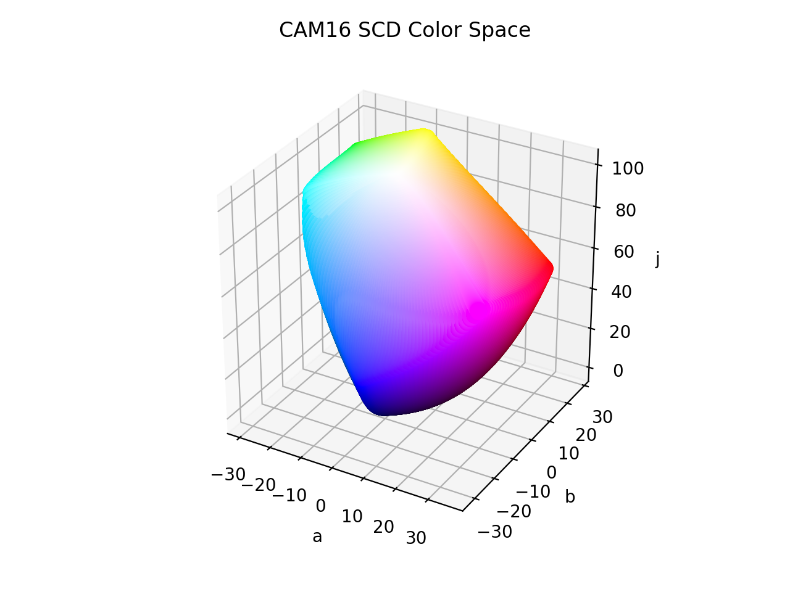

# CAM16 SCD

!!! failure "The CAM16 SCD color space is not registered in `Color` by default"

<div class="info-container" markdown="1">
!!! info inline end "Properties"

    **Name:** `cam16-scd`

    **White Point:** D65

    **Coordinates:**

    Name | Range^\*^
    ---- | -----
    `j`  | [0, 100]
    `a`  | [-40, 40]
    `b`  | [-40, 40]

    ^\*^ Space is not bound to the range and is only used as a reference to define percentage inputs/outputs in
    relation to the Display P3 color space.

<figure markdown>



<figcaption markdown>
The sRGB gamut represented within the CAM16 SCD color space.
</figcaption>
</figure>

This is the SCD variant of the CAM16 UCS color space and is optimized for "small" color distancing. See
[CAM16 UCS](./cam16_ucs.md) for more info.

[Learn more](https://doi.org/10.1002/col.22131).
</div>

## Channel Aliases

Channels | Aliases
-------- | -------
`j`      | `lightness`
`a`      |
`b`      |

## Input/Output

The CAM16 SCD space is not currently supported in the CSS spec, the parsed input and string output formats use
the `#!css-color color()` function format using the custom name `#!css-color --cam16-scd`:

```css-color
color(--cam16-scd j a b / a)  // Color function
```

The string representation of the color object and the default string output use the
`#!css-color color(--cam16-scd j a b / a)` form.

```playground
Color("cam16-scd", [59.178, 33.597, 17.41], 1)
Color("cam16-scd", [78.364, 8.3723, 24.725], 1).to_string()
```

## Registering

```py
from coloraide import Color as Base
from coloraide_extras.spaces.cam16_ucs import CAM16SCD

class Color(Base): ...

Color.register(CAM16SCD())
```

<style>
.info-container {display: inline-block;}
</style>

## Subclassing

CAM16 SCD is a color model that can vary due to viewing conditions. Factors such as coefficients used (UCS/SCD/LCD),
surround (average/dim/dark), adapting luminance, background luminance, white point, and whether the eye is assumed to be
fully adapted to the illuminant can all play into how the color model responds.

If it is desired to create a CAM16 SCD that uses different viewing conditions, the `CAM16SCD` class can be subclassed.
A new `Environment` object should be set to the class describing the viewing conditions. As CAM16 SCD is directly uses
the CAM16 (Jab) color space as its base for conversion, that base would also need to be subclassed with the correct
environment, or the the CAM16 SCD class would need to make the transform directly from XYZ. All the helper functions are
available to pull this off if needed.

When subclassing, always use a new, unique name, like `cam16-custom` as other features or color spaces may depend on the
`cam16-scd` name converting a certain way.

You can check out the source to learn more.
