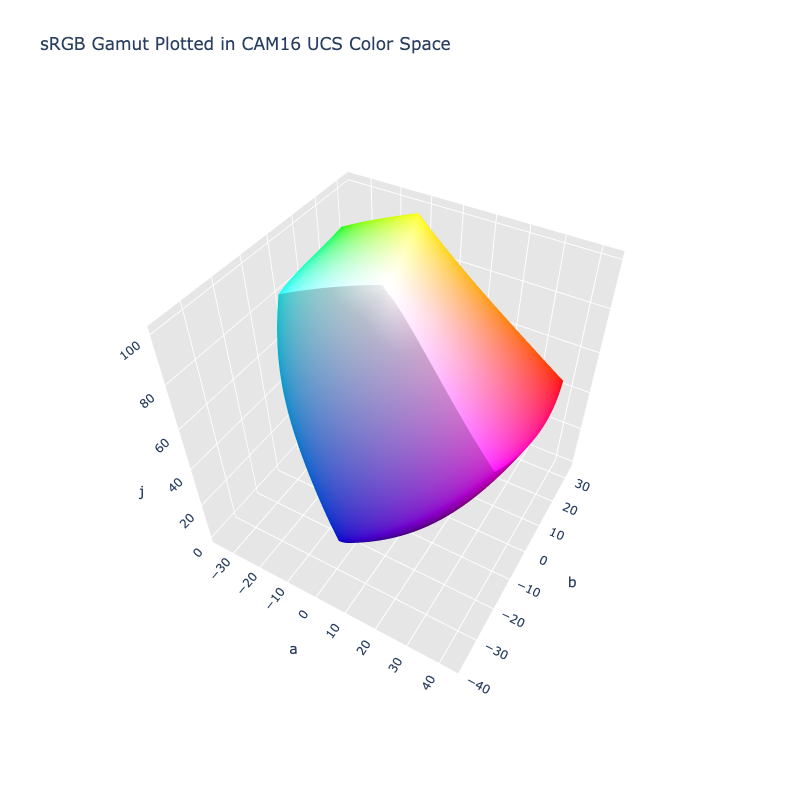

# CAM16 UCS

/// failure | The CAM16 UCS color space is not registered in `Color` by default
///

/// html | div.info-container
//// info | Properties
    attrs: {class: inline end}

**Name:** `cam16-ucs`

**White Point:** D65

**Coordinates:**

Name | Range^\*^
---- | -----
`j`  | [0, 100]
`a`  | [-50, 50]
`b`  | [-50, 50]

^\*^ Space is not bound to the range and is only used as a reference to define percentage inputs/outputs in
relation to the Display P3 color space.
////

//// html | figure


///// html | figcaption
The sRGB gamut represented within the CAM16 UCS color space.
/////
////

A color appearance model (CAM) is a mathematical model that seeks to describe the perceptual aspects of human color
vision, i.e. viewing conditions under which the appearance of a color does not tally with the corresponding physical
measurement of the stimulus source.

The CAM16 model is a successor of CIECAM02 with various fixes and improvements. The CAM16 UCS space takes the CAM16
model and applies an additional nonlinear transformation to lightness and colorfulness so that a color difference metric
ΔE can be based more closely on Euclidean distance. The `cam16-ucd` color space in ColorAide is based off CAM16 (Jab)
which uses M (colorfulness) to derive the a and b values. There are also [SCD](./cam16_scd.md) and [LCD](./cam16_lcd.md)
variants which optimize the spaces for "small" and "large" color distancing respectively.

[Learn more](https://doi.org/10.1002/col.22131).
///

## Channel Aliases

Channels | Aliases
-------- | -------
`j`      | `lightness`
`a`      |
`b`      |

## Input/Output

The CAM16 UCS space is not currently supported in the CSS spec, the parsed input and string output formats use
the `#!css-color color()` function format using the custom name `#!css-color --cam16-ucs`:

```css-color
color(--cam16-ucs j a b / a)  // Color function
```

The string representation of the color object and the default string output use the
`#!css-color color(--cam16-ucs j a b / a)` form.

```py play
Color("cam16-ucs", [59.178, 40.82, 21.153], 1)
Color("cam16-ucs", [78.364, 9.6945, 28.629], 1).to_string()
```

## Registering

```py
from coloraide import Color as Base
from coloraide_extras.spaces.cam16_ucs import CAM16UCS

class Color(Base): ...

Color.register(CAM16UCS())
```
