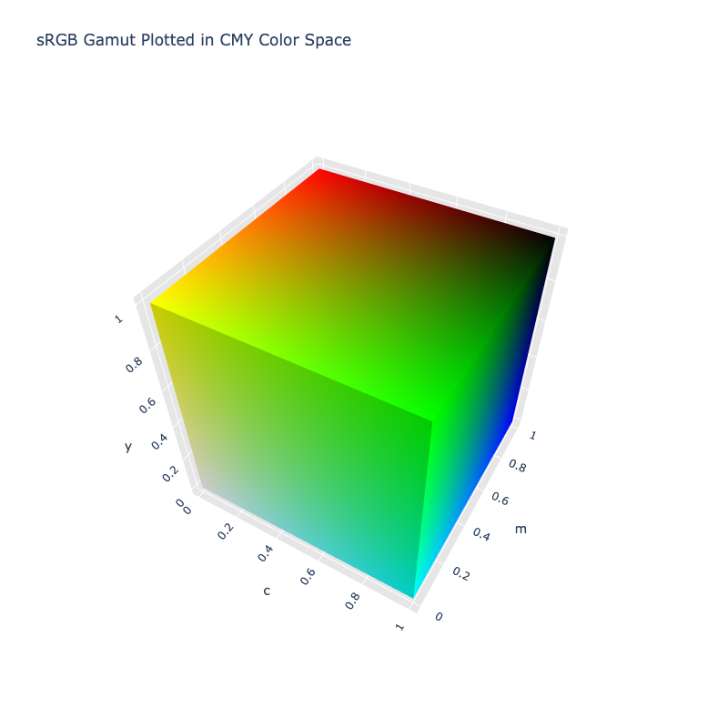

# CMY

!!! failure "The CMY color space is not registered in `Color` by default"

<div class="info-container" markdown>
!!! info inline end "Properties"

    **Name:** `cmy`

    **White Point:** D65

    **Coordinates:**

    Name | Range^\*^
    ---- | -----
    `c`  | [0, 1]
    `m`  | [0, 1]
    `y`  | [0, 1]

    ^\*^ Range denotes _in gamut_ colors, but the color space supports an extended range beyond the gamut.

<figure markdown>



<figcaption markdown>
The sRGB gamut represented within the CMY color space.
</figcaption>
</figure>

The CMY color model is a subtractive color model in which cyan, magenta and yellow pigments or dyes are added together
in various ways to reproduce a broad array of colors. The name of the model comes from the initials of the three
subtractive primary colors: cyan, magenta, and yellow.

The CMY color space, as ColorAide Extras has chosen to implement it, is directly calculated from the sRGB color space,
and as such, is based off the sRGB primaries.

[Learn more](https://en.wikipedia.org/wiki/CMY_color_model).
</div>

## Channel Aliases

Channels | Aliases
-------- | -------
`c`      | `cyan`
`m`      | `magenta`
`y`      | `yellow`

## Input/Output

CMY is not currently supported in the CSS spec, the parsed input and string output formats use the
`#!css-color color()` function format using the custom name `#!css-color --cmy`:

```css-color
color(--cmy c m y / a)  // Color function
```

The string representation of the color object and the default string output use the
`#!css-color color(--cmy c m y / a)` form.

```playground
Color("cmy", [0, 1, 1])
Color("cmy", [0, 0.35294, 1]).to_string()
```

## Registering

```py
from coloraide import Color as Base
from coloraide.spaces.cmy import CMY

class Color(Base): ...

Color.register(CMY())
```
