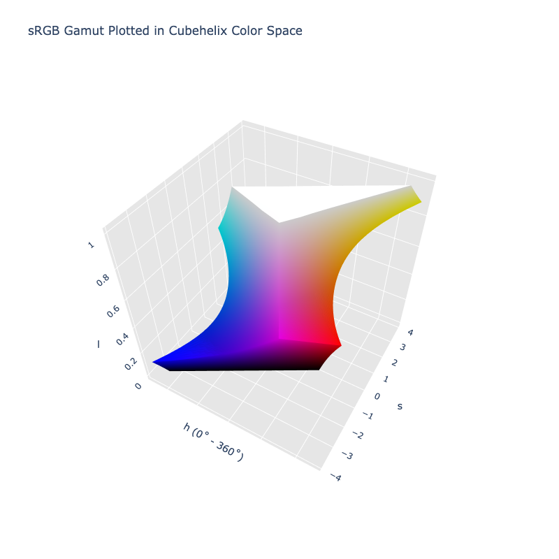
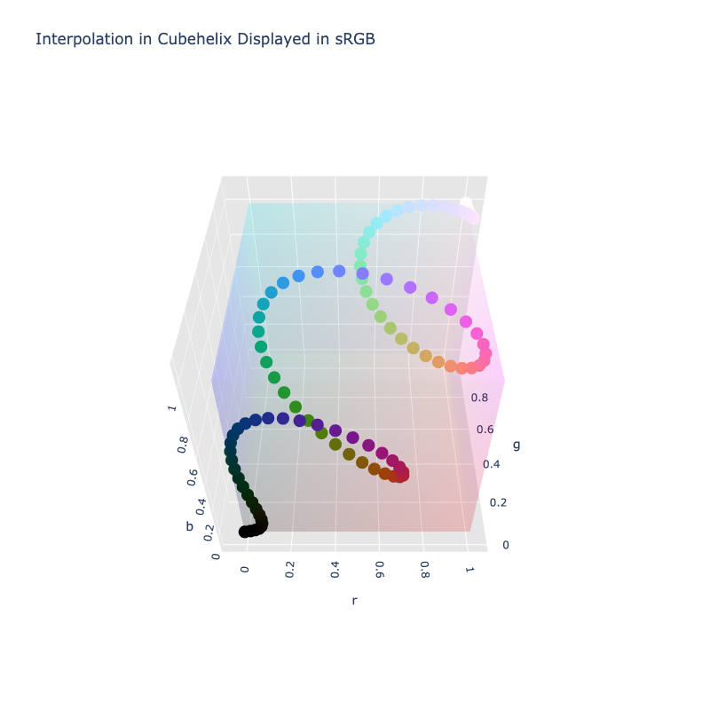

# Cubehelix

/// failure | The Cubehelix color space is not registered in `Color` by default
///

/// html | div.info-container
//// info | Properties
    attrs: {class: inline end}

**Name:** `cubehelix`

**White Point:** D65 / 2˚

**Coordinates:**

Name | Range^\*^
---- | -----
`h`  | [0, 360)
`s`  | [0, 4.614]
`l`  | [0, 1]

^\*^ The maximum saturation represents how high saturation can go, not that _all_ colors with that saturation will be
valid. As seen in the 3D rendering, while the coordinates are cylindrical, the shape of the space is not a cylinder.
////

//// html | figure


///// html | figcaption
The sRGB gamut represented within the Cubehelix color space.
/////
////

Cubehelix is a color scheme created by Dave Green. It was originally created for the display of astronomical intensity
images. It is not really one color scheme, but a method to generate various "cubehelix" color schemes. The name comes
from the way the colors spiral through the sRGB color space.

Mike Bostock of [Observable](https://observablehq.com/) and [D3](https://d3js.org/) fame along with Jason Davies took
the color scheme and created a cylindrical color space with it. This is the color space that is implemented in
ColorAide.

Cubehelix color schemes can be easily generated by interpolating in the color space.

```py play
c1 = Color('cubehelix', [0, 1, 0])
c2 = Color('cubehelix', [360, 1, 1])
Color.discrete([c1, c2], steps=16, space='cubehelix', hue='longer')
Color.interpolate([c1, c2], space='cubehelix', hue='longer')
```

You can change the scheme by changing the start and end angle.

```py play
c1 = Color('cubehelix', [0 + 180, 1, 0])
c2 = Color('cubehelix', [360 + 180, 1, 1])
Color.discrete([c1, c2], steps=16, space='cubehelix', hue='longer')
Color.interpolate([c1, c2], space='cubehelix', hue='longer')
```

You can increase the rotations by setting hue interpolation to `specified` and extending the angle difference to a
distance greater than 360.

```py play
c1 = Color('cubehelix', [0, 1, 0])
c2 = Color('cubehelix', [360 * 3, 1, 1])
Color.discrete([c1, c2], steps=16, space='cubehelix', hue='specified')
Color.interpolate([c1, c2], space='cubehelix', hue='specified')
```

You can even reverse the rotation by utilizing a negative difference in hue.

```py play
c1 = Color('cubehelix', [0, 1, 0])
c2 = Color('cubehelix', [-360, 1, 1])
Color.discrete([c1, c2], steps=16, space='cubehelix', hue='specified')
Color.interpolate([c1, c2], steps=16, space='cubehelix', hue='specified')
```

To adjust gamma, simply apply a gamma easing to lightness.

```py play
def ease_gamma(y=1.0):
    """Ease gamma."""

    return lambda t: t ** y

gamma = ease_gamma(0.2)

c1 = Color('cubehelix', [0, 1, 0])
c2 = Color('cubehelix', [-360, 1, 1])
Color.discrete(
    [c1, c2],
    steps=16,
    space='cubehelix',
    hue='specified',
    progress={'l': gamma}
)
Color.interpolate(
    [c1, c2],
    space='cubehelix',
    hue='specified',
    progress={'l': gamma}
)
```

Viewing the interpolation in 3D, we can see the spiraling of colors that gave the color scheme the name Cubehelix.



[Learn more](https://arxiv.org/pdf/1108.5083.pdf).
///

## Channel Aliases

Channels | Aliases
-------- | -------
`h`      | `hue`
`s`      | `saturation`
`l`      | `lightness`

## Input/Output

The Cubehelix space is not currently supported in the CSS spec, the parsed input and string output formats use the
`#!css-color color()` function format using the custom name `#!css-color --cubehelix`:

```css-color
color(--cubehelix h s l / a)  // Color function
```

The string representation of the color object and the default string output use the
`#!css-color color(--cubehelix h s l / a)` form.

```py play
Color("cubehelix", [351.81, 1.9489, 0.3])
Color("cubehelix", [36.577, 1.7357, 0.68176]).to_string()
```

## Registering

```py
from coloraide import Color as Base
from coloraide.spaces.cubehelix import Cubehelix

class Color(Base): ...

Color.register(Cubehelix())
```
