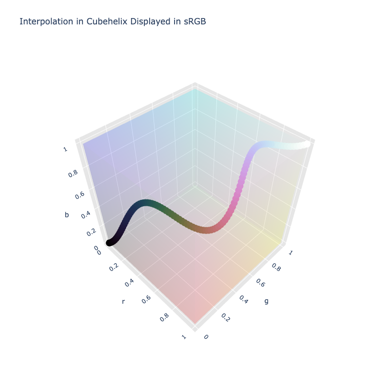

# Cubehelix

/// failure | The Cubehelix color space is not registered in `Color` by default
///

/// html | div.info-container
//// info | Properties
    attrs: {class: inline end}

**Name:** `cubehelix`

**White Point:** D65 / 2˚

**Coordinates:**

Name | Range^\*^
---- | -----
`h`  | [0, 360)
`s`  | [0, 4.614]
`l`  | [0, 1]

^\*^ The maximum saturation represents how high saturation can go within the sRGB gamut, not that _all_ colors with that
saturation will be valid in the sRGB gamut. As seen in the 3D rendering, while the coordinates are cylindrical, the
shape of the space within a given gamut may not be a perfect cylinder.
////


//// figure-caption
The sRGB gamut represented within the Cubehelix color space.
////

Cubehelix is a color schemes created by Dave Green. It was originally created for the display of astronomical intensity
images. While many may think of the cubehelix scheme as the default one described in the original paper, it is not
really one color scheme, but a method to generate various "cubehelix" color schemes. The name comes from the way the
color scheme spirals through the sRGB color space.

Mike Bostock of [Observable](https://observablehq.com/) and [D3](https://d3js.org/) fame, along with Jason Davies, took
the color scheme and created a cylindrical color space with it. This is the color space that is implemented in
ColorAide and can be used directly to generate various cubehelix color schemes.

```py play
c1 = Color('cubehelix', [300, 0.5, 0])
c2 = Color('cubehelix', [-240, 0.5, 1])
Color.discrete([c1, c2], steps=16, space='cubehelix', hue='specified')
Color.interpolate([c1, c2], space='cubehelix', hue='specified')
```

Viewing the interpolation in 3D, we can see the spiraling of colors that gave the color scheme the name Cubehelix.


/// figure-caption
The default cubehelix color scheme in 3D.
///

[Learn more](https://arxiv.org/pdf/1108.5083.pdf).
///

## Channel Aliases

Channels | Aliases
-------- | -------
`h`      | `hue`
`s`      | `saturation`
`l`      | `lightness`

## Input/Output

The Cubehelix space is not currently supported in the CSS spec, the parsed input and string output formats use the
`#!css-color color()` function format using the custom name `#!css-color --cubehelix`:

```css-color
color(--cubehelix h s l / a)  // Color function
```

The string representation of the color object and the default string output use the
`#!css-color color(--cubehelix h s l / a)` form.

```py play
Color("cubehelix", [351.81, 1.9489, 0.3])
Color("cubehelix", [36.577, 1.7357, 0.68176]).to_string()
```

## Registering

```py
from coloraide import Color as Base
from coloraide.spaces.cubehelix import Cubehelix

class Color(Base): ...

Color.register(Cubehelix())
```

## Generating Color Schemes

Cubehelix color schemes can be easily generated by interpolating within the cubehelix color space. Below is the default
color scheme as described in the original paper.

The original paper described an algorithm for generating cubehelix color schemes and highlighted four parameters that
are used to control the output. The cubehelix color space incorporates this logic within itself to create a color space
and can be used directly to generate the same color schemes via simple interpolation. The exact same parameters can be
applied to the interpolation process (with some minor translations) to give the same output.

To explain how the color schemes can programmatically be generated, first we'll cover the four parameters and how they
relate to our cylindrical color space and the interpolation process. Lastly, we'll show the logic with them all working
together to create color schemes.

It should be noted that we assume interpolation is being performed with the `specified` hue logic as it is needed to
handle hue rotations that are greater 360˚.

//// settings | Cubehelix Scheme Options
/// define
start

-   The 'start' color. This is the direction of the predominant color deviation from black at the start of the color
    scheme with R=1, G=2, B=3, etc. In the context of the Cubehelix cylindrical space, this is translated to an actual
    hue as shown below.

    $$
    start\_hue = ((start - 1) * 120) \bmod 360
    $$
///

/// define
rotation

-   Number of rotations through the hues from the start (i.e. black) to the end (i.e. white). In the context of the
    Cubehelix cylindrical space, this is essentially used to define the ending hue within a `specified` interpolation.
    Assuming the starting hue as `start_hue`, rotation is applied as shown below.

    $$
    end\_hue = start\_hue + (360 * rotation)
    $$
///

/// define
hue

-   Named "hue" in the paper, this option actually controls how saturated the color of all hues are. If this parameter
    is zero, the color scheme is purely grayscale. The "hue" parameter is applied to the saturation component of both
    the start and end color after dividing it by 2.

    $$
    saturation = hue / 2
    $$
///

/// define
gamma

-   A 'factor' that can be used to emphasize low or high intensity values. Essentially places an easing function on the
    lightness. If `t` is the progress of the interpolation between the start and end color, and gamma is `y`, then an
    easing function can be applied to interpolation progress of the lightness component as shown below.

    $$
    t\_new = t^y
    $$
///
////

With a clear understanding of the four parameters, we can then define a function that accepts the parameters and
constructs an interpolation that yields the desired color scheme.

```py play
from coloraide import algebra as alg

def cubehelix_scheme(start, rotation, hue, gamma, out_space='srgb', domain=(0, 1)):
    """Generate a Cubehelix scheme."""

    start_hue = ((start - 1) * 120) % 360
    end_hue = start_hue + (360 * rotation)
    saturation = hue / 2
    begin = Color('cubehelix', [start_hue, saturation, 0])
    end =  Color('cubehelix', [end_hue, saturation, 1])
    return Color.interpolate(
        [begin, end],
        space='cubehelix',
        hue='specified',
        progress={'l': lambda t, y=gamma: t ** y} if gamma != 1 else None,
        domain=domain,
        out_space=out_space
    )

scheme = cubehelix_scheme(0.5, -1.5, 1, 1)
Steps([scheme(i).clip('srgb') for i in alg.linspace(0, 1, 100, endpoint=True)])
scheme = cubehelix_scheme(0.5, -1.5, 1.5, 1)
Steps([scheme(i).clip('srgb') for i in alg.linspace(0, 1, 100, endpoint=True)])
scheme = cubehelix_scheme(0.5, -1, 1, 1)
Steps([scheme(i).clip('srgb') for i in alg.linspace(0, 1, 100, endpoint=True)])
scheme = cubehelix_scheme(1.5, -1.5, 1, 1)
Steps([scheme(i).clip('srgb') for i in alg.linspace(0, 1, 100, endpoint=True)])
```

While this shows a direct translation of the paper's algorithm and parameters to the cubehelix color space via
interpolation, a more intuitive approach may be to simply accept a starting hue, number of rotations, saturation,
and gamma.

```py play
from coloraide import algebra as alg

def cubehelix_scheme(start_hue, rotation, saturation, gamma, out_space='srgb', domain=(0, 1)):
    """Generate a Cubehelix scheme."""

    begin = Color('cubehelix', [start_hue, saturation, 0])
    end =  Color('cubehelix', [start_hue + (360 * rotation), saturation, 1])
    return Color.interpolate(
        [begin, end],
        space='cubehelix',
        hue='specified',
        progress={'l': lambda t, y=gamma: t ** y} if gamma != 1 else None,
        domain=domain,
        out_space=out_space
    )

scheme = cubehelix_scheme(300, -1.5, 0.5, 1)
Steps([scheme(i).clip('srgb') for i in alg.linspace(0, 1, 100, endpoint=True)])
scheme = cubehelix_scheme(300, -1.5, 0.75, 1)
Steps([scheme(i).clip('srgb') for i in alg.linspace(0, 1, 100, endpoint=True)])
scheme = cubehelix_scheme(300, -1, 0.5, 1)
Steps([scheme(i).clip('srgb') for i in alg.linspace(0, 1, 100, endpoint=True)])
scheme = cubehelix_scheme(60, -1.5, 0.5, 1)
Steps([scheme(i).clip('srgb') for i in alg.linspace(0, 1, 100, endpoint=True)])
```
