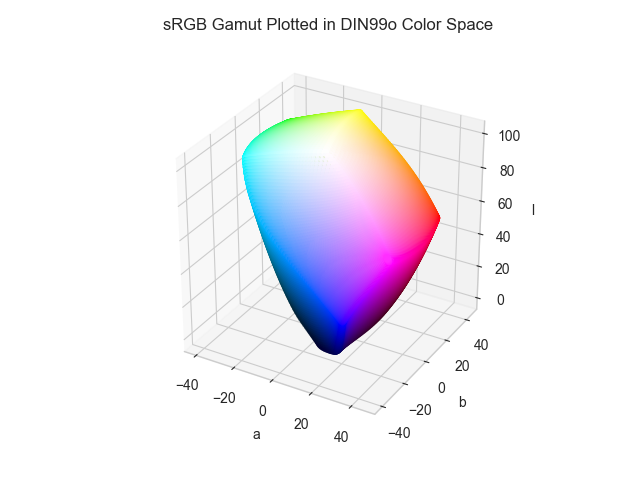

# DIN99o

/// failure | The DIN99o color space is not registered in `Color` by default
///

/// html | div.info-container
//// info | Properties
    attrs: {class: inline end}

**Name:** `din99o`

**White Point:** D65

**Coordinates:**

Name | Range^\*^
---- | ---------
`l`  | [0, 100]
`a`  | [-55, 55]
`b`  | [-55, 55]

^\*^ Space is not bound to the range and is only used as a reference to define percentage inputs/outputs in
relation to the Display P3 color space.
////

//// html | figure


///// html | figcaption
The sRGB gamut represented within the DIN99o color space.
/////
////

The DIN99 color space system is a further development of the CIELab color space system developed by the FNF / FNL 2
Colorimetry Working Committee. It takes the CIELab space (with a D65 illuminant) and compresses it such that the space
yields better equidistant using Euclidean distance. The whole color space is essentially modified to better fit the
color distancing algorithm opposed to CIELab which has adapted the color distancing algorithm to better fit the color
space, the latest iteration being ∆E^\*^~00~.

_[Learn about DIN99o](https://de.wikipedia.org/wiki/DIN99-Farbraum)_
///

## Channel Aliases

Channels | Aliases
-------- | -------
`l`      | `lightness`
`a`      |
`b`      |

## Input/Output

As DIN99o is not currently supported in the CSS spec, the parsed input and string output formats use the
`#!css-color color()` function format using the custom name `#!css-color --din99o`:

```css-color
color(--din99o l u v / a)  // Color function
```

When manually creating a color via raw data or specifying a color space as a parameter in a function, the color
space name is always used:

```py
Color("din99o", [0, 0, 0], 1)
```

The string representation of the color object and the default string output use the
`#!css-color color(--din99o l u v / a)` form.

```py play
Color("din99o", [57.289, 39.498, 30.518])
Color("din99o", [77.855, 16.444, 40.318]).to_string()
```

## Registering

```py
from coloraide import Color as Base
from coloraide.spaces.din99o import DIN99o

class Color(Base): ...

Color.register(DIN99o())
```
