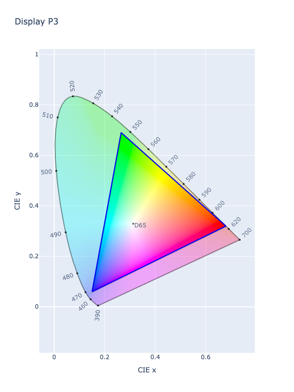

# Display P3

!!! success "The Display P3 color space is registered in `Color` by default"

<div class="info-container" markdown>
!!! info inline end "Properties"

    **Name:** `display-p3`

    **White Point:** D65

    **Coordinates:**

    Name | Range^\*^
    ---- | -----
    `r`  | [0, 1]
    `g`  | [0, 1]
    `b`  | [0, 1]

    ^\*^ Range denotes _in gamut_ colors, but the color space supports an extended range beyond the gamut.

<figure markdown>



<figcaption markdown>
CIE 1931 xy Chromaticity -- Display P3 Chromaticities
</figcaption>
</figure>

Display P3 is a combination of the DCI-P3 color gamut with the D65 white point together with the [sRGB](./srgb.md) gamma
curve. It originated from the DCI-P3 color gamut's implementation in digital cinema projectors, as this standard offers
more vibrant greens and reds than the traditional [sRGB](./srgb.md) color gamut.

_[Learn about Display P3](https://www.color.org/chardata/rgb/DisplayP3.xalter)_
</div>

## Channel Aliases

Channels | Aliases
-------- | -------
`r`      | `red`
`g`      | `green`
`b`      | `blue`

## Input/Output

Parsed input and string output formats support all valid CSS forms:

```css-color
color(display-p3 r g b / a)  // Color function
```

When manually creating a color via raw data or specifying a color space as a parameter in a function, the color
space name is always used:

```py
Color("display-p3", [0, 0, 0], 1)
```

The string representation of the color object and the default string output will be in the
`#!css-color color(display-p3 r g b / a)` form.

```playground
Color('display-p3', [0.91749, 0.20029, 0.13856])
Color('display-p3', [0.94965, 0.6629, 0.23297]).to_string()
```

## Registering

```py
from coloraide import Color as Base
from coloraide.spaces.display_p3 import DisplayP3

class Color(Base): ...

Color.register(DisplayP3())
```
