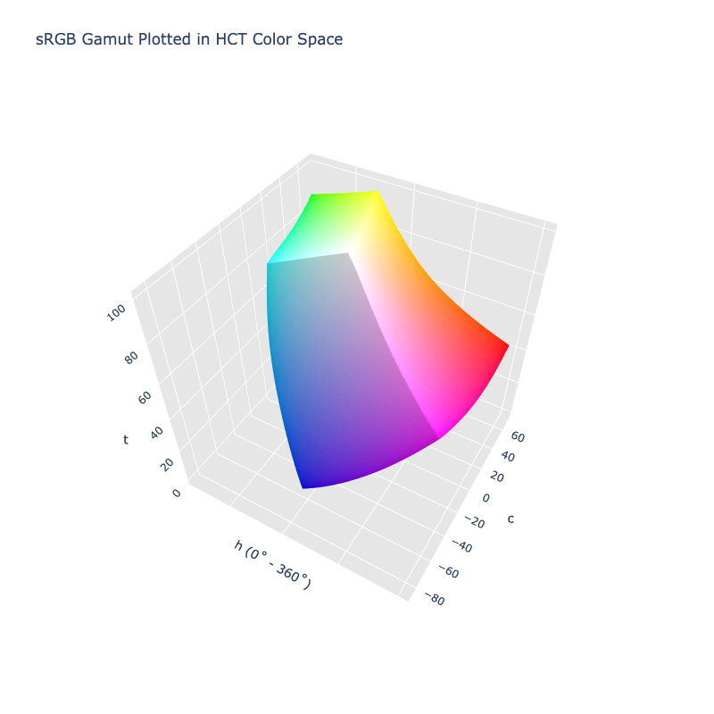

# HCT

/// failure | The HCT color space is not registered in `Color` by default
///

/// html | div.info-container
//// info | Properties
    attrs: {class: inline end}

**Name:** `hct`

**White Point:** D65

**Coordinates:**

Name | Range^\*^
---- | -----
`h`  | [0, 360)
`c`  | [0, 145]
`t`  | [0, 100]

^\*^ Space is not bound to the range and is only used as a reference to define percentage inputs/outputs in
relation to the Display P3 color space.
////

//// html | figure


///// html | figcaption
The sRGB gamut represented within the HCT color space.
/////
////

The HCT color space is Google's attempt at a perceptually accurate color system. Essentially, it is two color spaces
glued together: 'H' (hue) and 'C' (chroma) come from the CAM16 color appearance model and 'T' (tone) is the lightness
from the CIELAB (D65) color space. The space was created to take the more consistent perceptual hues from CAM16 and use
the better lightness prediction found in CIELAB. The color space has the advantage of being well suited for creating
color schemes with decent contrast and makes it easy to create nice tonal palettes, but the downside is that it is
expensive to translate to and from compared to other color spaces.

Since HCT is partly based on CAM16, it inherits the expensive operations used to translate color to and from the CAM16
color model. In the forward direction (to HCT) color conversions are only marginally more expensive than CAM16, but in
the reverse direction (from HCT) the conversions are much more expensive. This is because the CAM16 color model needs
the context of chroma, hue, and lightness in order to translate any of its components, but HCT throws away CAM16
lightness and uses CIELAB lightness which has no direct relation to the other components. In order to translate color
from HCT, more complex methods are needed to approximate the missing CAM16 lightness in order for a good round trip
conversion.

Google implements the HCT color space in their "Material Color Utilities" library, but in that library it is restricted
to sRGB and only to 8 bit precision. Wide gamut colors such as Display P3 cannot be used.

ColorAide's goal was not to port Material's Color Utilities, but to implement HCT as a proper color space that can be
used in sRGB and other wide gamut color spaces. In ColorAide we implement the HCT color space exactly as described and
create the space from both CIELAB and CAM16. We then provide a generic approximation back out of HCT at a higher
precision to better support not only sRGB, but other wide gamut color spaces such as: Display P3, Rec. 2020, A98 RGB,
etc.

//// note | Conversion Limitations
Extreme colors, like those in ProPhoto RGB that fall outside the visible spectrum, may be difficult to round trip
with the same high accuracy as other colors well inside the visible spectrum. These colors naturally stress the CAM16
color model and make approximation from HCT even more difficult. With that said, most color spaces within the visible
spectrum should convert reasonably well.
////

[Learn more](https://material.io/blog/science-of-color-design).
///

## Channel Aliases

Channels | Aliases
-------- | -------
`h`      | `hue`
`c`      | `chroma`
`t`      | `tone`, `lightness`

## Input/Output

The HCT space is not currently supported in the CSS spec, the parsed input and string output formats use
the `#!css-color color()` function format using the custom name `#!css-color --hct`:

```css-color
color(--hct h c t / a)  // Color function
```

The string representation of the color object and the default string output use the
`#!css-color color(--hct h c t / a)` form.

```py play
Color("hct", [27.41, 113.36, 53.237], 1)
Color("hct", [71.257, 60.528, 74.934], 1).to_string()
```

## Registering

```py
from coloraide import Color as Base
from coloraide.spaces.hct import HCT

class Color(Base): ...

Color.register(HCT())
```

## Tonal Palettes

One of the applications of HCT is generating tonal palettes. When coupled with ColorAide's [∆E~hct~](../distance.md#delta-e-hct)
distancing algorithm and the [`hct-chroma` gamut mapping algorithm](../gamut.md#hct-chroma), we can produce tonal
palettes just like in Material Color Utilities.

```py play
c = Color('hct', [325, 24, 50])
tones = [0, 10, 20, 30, 40, 50, 60, 70, 80, 90, 95, 100]
Steps([c.clone().set('tone', tone).convert('srgb').to_string(hex=True, fit='hct-chroma') for tone in tones])
```

Material Color Utilities, as they currently implement it, only works within the sRGB color space, but ColorAide
implements HCT such that it can be used in various wide gamuts as well.

```py play
tones = [0, 10, 20, 30, 40, 50, 60, 70, 80, 90, 95, 100]
c1 = Color('display-p3', [1, 0, 1]).convert('hct')
Steps([c1.clone().set('tone', tone).convert('display-p3').to_string(fit='hct-chroma') for tone in tones])
c2 = Color('rec2020', [0, 0, 1]).convert('hct')
Steps([c2.clone().set('tone', tone).convert('rec2020').to_string(fit='hct-chroma') for tone in tones])
```

Due to differences in approximation techniques, general precision differences, and gamut mapping of the two
implementations internally, ColorAide may return colors slightly different from Material Color Utilities. These
differences are extremely small and not perceptible to the eye.

Below we have two examples. We've taken the results from Material's tests and we've generated the same tonal palettes
and output both as HCT. We can compare which hues stay overall more constant, which chroma gets reduced more than
others, and which hue and tone are less affected by the gamut mapping. Can you definitively say that one looks more
correct than the other? Can you say there is notable, visual difference?

```py play
def tonal_palette(c):
    tones = [0, 10, 20, 30, 40, 50, 60, 70, 80, 90, 95, 100]
    return [c.clone().set('tone', tone).fit('srgb', method='hct-chroma') for tone in tones]

material1 = ['#000000', '#00006e', '#0001ac',
             '#0000ef', '#343dff', '#5a64ff',
             '#7c84ff', '#9da3ff', '#bec2ff',
             '#e0e0ff', '#f1efff', '#ffffff']
c = Color('blue').convert('hct')
Steps([x.to_string() for x in tonal_palette(c)])
Steps([Color(x).convert('hct').to_string() for x in material1])

material2 = ['#000000', '#191a2c', '#2e2f42',
             '#444559', '#5c5d72', '#75758b',
             '#8f8fa6', '#a9a9c1', '#c5c4dd',
             '#e1e0f9', '#f1efff', '#ffffff']
c['chroma'] = 16
Steps([x.to_string() for x in tonal_palette(c)])
Steps([Color(x).convert('hct').to_string() for x in material2])
```
