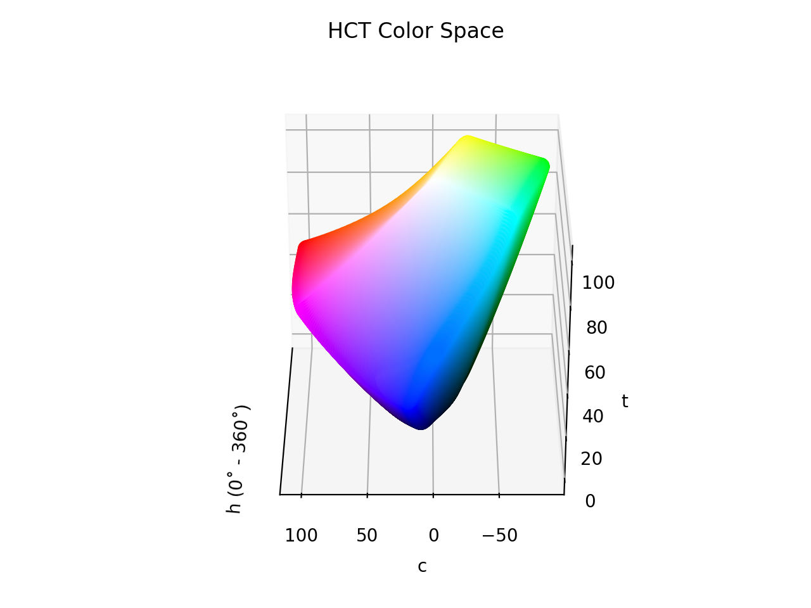

# HCT

!!! failure "The HCT color space is not registered in `Color` by default"

<div class="info-container" markdown="1">
!!! info inline end "Properties"

    **Name:** `hct`

    **White Point:** D65

    **Coordinates:**

    Name | Range^\*^
    ---- | -----
    `h`  | [0, 360)
    `c`  | [0, 145]
    `t`  | [0, 100]

    ^\*^ Space is not bound to the range and is only used as a reference to define percentage inputs/outputs in
    relation to the Display P3 color space.

<figure markdown>



<figcaption markdown>
The sRGB gamut represented within the HCT color space.
</figcaption>
</figure>

The HCT color space is Google's attempt at a perceptually accurate color system. Essentially, it is two color spaces
glued together. 'H' (hue) and 'C' (chroma) come from the CAM16 color appearance model and 'T' (tone) is the lightness
from the CIELAB (D65) color space. The idea was to take the more consistent perceptual hues from CAM16 and use the
better lightness prediction found in CIELAB, so a new space was created by literally sticking the components together.

In general, CAM16 is not a cheap color space to calculate, and all the glue to hold the components together makes it a
bit more expensive, but considering the use case that it was designed for, creating better color schemes with decent
contrast, it has attractive benefits.

[Learn more](https://material.io/blog/science-of-color-design).
</div>

## Channel Aliases

Channels | Aliases
-------- | -------
`h`      | `hue`
`c`      | `chroma`
`t`      | `tone`, `lightness`

## Input/Output

The HCT space is not currently supported in the CSS spec, the parsed input and string output formats use
the `#!css-color color()` function format using the custom name `#!css-color --hct`:

```css-color
color(--hct h c t / a)  // Color function
```

The string representation of the color object and the default string output use the
`#!css-color color(--hct h c t / a)` form.

```playground
Color("hct", [27.41, 113.36, 53.237], 1)
Color("hct", [71.257, 60.528, 74.934], 1).to_string()
```

## Registering

```py
from coloraide import Color as Base
from coloraide.spaces.hct import HCT

class Color(Base): ...

Color.register(HCT())
```

<style>
.info-container {display: inline-block;}
</style>

## Tonal Palettes

One of the applications of HCT is generating tonal palettes. When coupled with ColorAide's [∆E~hct~](../distance.md#delta-e-hct)
distancing algorithm and the [`hct-chroma` gamut mapping algorithm](../gamut.md#hct-chroma), we can produce tonal
palettes just like in Material's color utilities.

```playground
c = Color('hct', [325, 24, 50])
tones = [0, 10, 20, 30, 40, 50, 60, 70, 80, 90, 95, 100]
HtmlSteps([c.clone().set('tone', tone).convert('srgb').to_string(hex=True, fit='hct-chroma') for tone in tones])
```

Results in our library may be slightly different in some cases compared to Material's color utilities. This is because
we have implemented the library as _described_, we did not port their implementation and so we do not share the exact
same quirks of their implementation.

Material uses different precision for their transformation matrices between sRGB and XYZ. The exact chroma reduction
algorithms are likely different, though the end result is very similar.

Consider the example below. We've taken the results from Material's tests. We generate the same tonal palettes and
output both as HCT. We can compare which hues stay overall more constant, which chroma gets reduced more than others,
and which hue and tone are less affected by the gamut mapping. Can you tell which is doing the job the _best_?

```playground
def tonal_palette(c):
    tones = [0, 10, 20, 30, 40, 50, 60, 70, 80, 90, 95, 100]
    return [c.clone().set('tone', tone).fit('srgb', method='hct-chroma') for tone in tones]

material1 = ['#000000', '#00006e', '#0001ac',
             '#0000ef', '#343dff', '#5a64ff',
             '#7c84ff', '#9da3ff', '#bec2ff',
             '#e0e0ff', '#f1efff', '#ffffff']
c = Color('blue').convert('hct')
HtmlSteps([x.to_string() for x in tonal_palette(c)])
HtmlSteps([Color(x).convert('hct').to_string() for x in material1])

material2 = ['#000000', '#191a2c', '#2e2f42',
             '#444559', '#5c5d72', '#75758b',
             '#8f8fa6', '#a9a9c1', '#c5c4dd',
             '#e1e0f9', '#f1efff', '#ffffff']
c['chroma'] = 16
HtmlSteps([x.to_string() for x in tonal_palette(c)])
HtmlSteps([Color(x).convert('hct').to_string() for x in material2])
```
