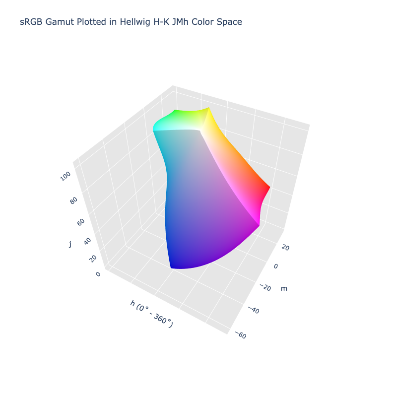

# Hellwig JMh

/// failure | The Hellwig JMh color space is not registered in `Color` by default
///

/// html | div.info-container
//// info | Properties
    attrs: {class: inline end}

**Name:** `hellwig-jmh`

**White Point:** D65 / 2˚

**Coordinates:**

Name | Range^\*^
---- | -----
`j`  | [0, 100]
`m`  | [0, 105]
`h`  | [0, 360)

^\*^ Space is not bound to the range and is only used as a reference to define percentage inputs/outputs in
relation to the Display P3 color space.
////


//// figure-caption
The sRGB gamut represented within the Hellwig JMh color space.
////

The Hellwig color model is an unofficial name for the CAM16 model with applied "fixes" as published by Luke Hellwig and
Mark Fairchild entitled 'Brightness, lightness, colorfulness, and chroma in CIECAM02 and CAM16'. The paper suggests
a number of changes to the brightness and lightness properties changing their non-linear relationship to a linear
relationship. It also details a reevaluation of chroma, colorfulness, and saturation making some suggestions additional
changes.

The model defines numerous different attributes:

Name | Description
---- | -----------
J    | Lightness
C    | Chroma
h    | hue
s    | saturation
Q    | Brightness
M    | Colorfulness
H    | Hue Quadrature

A color space can be constructed of using a subset of these attributes: JCh, JMh, Jsh, QCh, QMh, Qsh, etc. You can also
construct Lab like spaces taking using the hue and either C, M, or s. The `hellwig-jmh` color space in ColorAide
represents the JMh configuration.

[Learn more](http://markfairchild.org/PDFs/PAP45.pdf).
///

## Adjustments for Helmholtz–Kohlrausch Effect

/// failure | The Hellwig H-K JMh color space is not registered in `Color` by default
///

/// html | div.info-container
//// info | Properties
    attrs: {class: inline end}

**Name:** `hellwig-hk-jmh`

**White Point:** D65 / 2˚

**Coordinates:**

Name | Range^\*^
---- | -----
`j`  | [0.0, ~101.560]
`m`  | [0, 105]
`h`  | [0, 360)

^\*^ Space is not bound to the range and is only used as a reference to define percentage inputs/outputs in
relation to the Display P3 color space.
////


//// figure-caption
The sRGB gamut represented within the Hellwig H-K JMh color space.
////

The Helmholtz–Kohlrausch effect (after Hermann von Helmholtz and V. A. Kohlrausch) is a perceptual phenomenon wherein
the intense saturation of spectral hue is perceived as part of the color's luminance. This creates a hue and chroma
dependency that affects lightness and brightness.

After the initial paper describing the Hellwig corrections, Luke Hellwig, Dale Stolitzka, and Mark Fairchild published
another paper that modified lightness and brightness further to better represent the Helmholtz–Kohlrausch effect in the
CAM16 model.

The paper entitled 'Extending CIECAM02 and CAM16 for the Helmholtz–Kohlrausch effect' outlined additional changes to the
lightness and brightness calculations of CAM16 and CIECAM02 that allowed the models to better simulate the
Helmholtz–Kohlrausch effect. These changes are required to made on top of the original modifications of brightness and
lightness as described by in the first Hellwig paper.

[Learn more](https://www.scribd.com/document/788387893/Color-Research-Application-2022-Hellwig-Extending-CIECAM02-and-CAM16-for-the-Helmholtz-Kohlrausch-effect)
///

## Viewing Conditions

Hellwig is a color appearance model and can be configured with different viewing environments. A Hellwig color space
will also have an associated environment object. This environment object determines the viewing conditions. Colors will
appear different based on the viewing conditions.

Viewing\ Conditions          | Description
---------------------------- | -----------
White                        | This is the white point and should be the same as defined in the color class. This is provided as (x, y) chromaticity coordinates.
Adapting\ Luminance          | The luminance of the adapting field (`La`). The units are in cd/m2.
Background\ Luminance        | The background luminance (`Yb`) the relative luminance of the nearby background (out to 10°), relative to the reference white's luminance (`Y`). Usually 20 providing a gray world assumption.
Surround                     | A description of the peripheral area. Use "dark" for a movie theater, "dim" for e.g. viewing a bright television in a dimly lit room, or "average" for surface colors.
Discounting                  | Discounts the illuminant. If true, the eye is assumed to be fully adapted to the illuminant. Otherwise, the degree of discounting is based on other parameters. When the eye is not fully adapted, it can affect the way colors appear and the chromatic response.
Helmholtz–Kohlrausch\ effect | If true, account for the Helmholtz–Kohlrausch effect by further adjusting lightness and brightness.

ColorAide must provide some defaults, so Hellwig comes with a default set of viewing conditions that uses a D65 white
point, an adapting luminance of 64 lux or a value of ~4 cd/m^2^, it uses the "gray world" assumption and sets the
background to 20, an "average" surround and leaves discounting set to `#!py False`. The Helmholtz–Kohlrausch\ effect
handling is only enabled for the `hellwig-hk-jmh` variant.

The default settings do not have to be used and a new Hellwig variant with different viewing conditions can be created.
When doing this, the space should be derived from the default.

```py play
from coloraide import Color as Base
from coloraide.spaces.hellwig import HellwigJMh, Environment
from coloraide.cat import WHITES
from coloraide import util
import math

class CustomHellwigJMh(HellwigJMh):
    NAME = "hellwig-custom"
    SERIALIZE = ("--hellwig-custom",)
    WHITE = WHITES['2deg']['D65']
    ENV = Environment(
        white=WHITE,
        adapting_luminance=1000 / math.pi,
        background_luminance=20,
        surround='average',
        discounting=False,
        hk=False
    )

class Color(Base): ...

Color.register([HellwigJMh(), CustomHellwigJMh()])

Color('white').convert('hellwig-jmh')
Color('white').convert('hellwig-custom')
```

/// note
It can be noted in the above example that white does not have the typical zero chroma. This is because the eye is not
assumed as being fully adapted to the environment. Due to the environment, the colors considered achromatic may appear
differently.

If `discounting` was enabled, the eye is then assumed to be fully adapted, and achromatic colors would align better with
expectations in other color spaces.
///

## Channel Aliases

Channels | Aliases
-------- | -------
`j`      | `lightness`
`m`      | `colorfulness`
`h`      | `hue`

## Input/Output

The Hellwig JMh space is not currently supported in the CSS spec, the parsed input and string output formats use
the `#!css-color color()` function format using the custom name `#!css-color --hellwig-jmh`. When adjustments for the
Helmholtz–Kohlrausch effect are enabled, the custom name `#!css-color --hellwig-hk-jmh` is used.

```css-color
color(--hellwig-jmh j m h / a)  // Color function
color(--hellwig-hk-jmh j m h / a)  // Color function
```

The string representation of the color object and the default string output use the
`#!css-color color(--hellwig-jmh j m h / a)` form. If using the H-K variant,
`#!css-color color(--hellwig--hk-jmh j m h / a)` is used.

```py play
Color("hellwig-jmh", [46.026, 47.347, 27.393], 1)
Color("hellwig-jmh", [68.056, 31.228, 71.293], 1).to_string()
Color("hellwig-hk-jmh", [97.726, 33.735, 111.15], 1)
Color("hellwig-hk-jmh", [39.201, 27.019, 142.3], 1).to_string()
```

## Registering

Either Hellwig JMh, Hellwig H-K JMh, or both can be registered.

```py
from coloraide import Color as Base
from coloraide.spaces.hellwig import HellwigJMh, HellwigHKJMh

class Color(Base): ...

Color.register([HellwigJMh(), HellwigHKJMh()])
```
