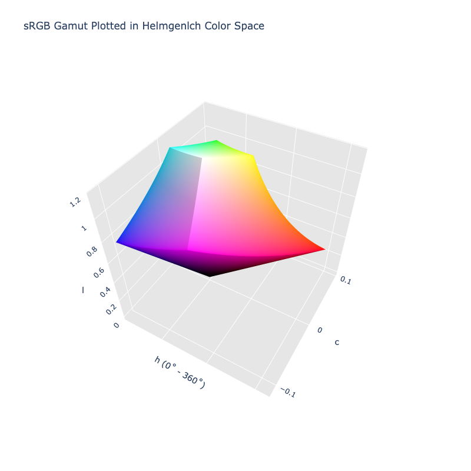

# Helmgenlch

> [!failure] The Helmgenlch color space is not registered in `Color` by default

/// html | div.info-container
> [!info | inline | end] Properties
> **Name:** `helmgenlch`
>
> **White Point:** D65 / 2˚ (Variant from ASTM-E308)
>
> **Coordinates:**
>
> Name | Range^\*^
> ---- | -----
> `l`  | [0, ~1.168]
> `c`  | [0, 0.4]
> `h`  | [0, 360]
>
> ^\*^ Space is not bound to the range and is only used as a reference to define percentage inputs/outputs.


//// figure-caption
The sRGB gamut represented within the Helmgenlch color space.
////

Helmlab is a family of purpose-built color spaces: MetricSpace (72-parameter enriched pipeline for perceptual distance)
and GenSpace (generation-optimized pipeline for gradients and palettes). MetricSpace achieves STRESS 23.30 on COMBVD
(3,813 color pairs) - a 20.1% improvement over CIEDE2000. GenSpace + arc-length reparameterization produces perfectly
uniform gradients (CV ≈ 0% on any color pair).

Helmgenlch is the GenSpace in polar form and is specifically used for interpolation, palettes, etc. It is the general
purpose color space of the Helmlab family.

[Learn more](https://arxiv.org/abs/2602.23010).
///

## Channel Aliases

Channels | Aliases
-------- | -------
`l`      | `lightness`
`c`      | `chroma`
`hue`    | `hue`

**Inputs**

The Helmlab space is not currently supported in the CSS spec, the parsed input and string output formats use the
`#!css-color color()` function format using the custom name `#!css-color --helmgenlch`:

```css-color
color(--helmgenlch l a b / a)  // Color function
```

The string representation of the color object and the default string output use the
`#!css-color color(--helmgenlch l a b / a)` form.

```py play
Color("helmgenlch", [0.60503, 0.22053, 8.5153])
Color("helmgenlch", [0.81194, 0.11553, 20.862]).to_string()
```

## Registering

```py
from coloraide import Color as Base
from coloraide.spaces.helmgenlch import Helmgenlch

class Color(Base): ...

Color.register(Helmgenlch())
```
