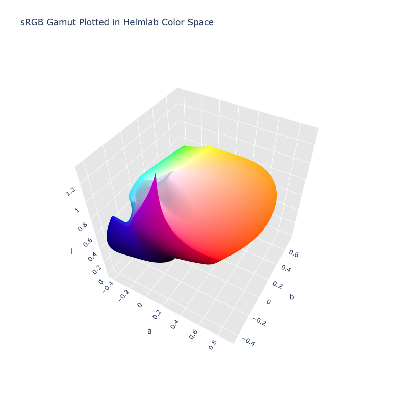

# Helmlab

> [!failure] The Helmlab color space is not registered in `Color` by default

/// html | div.info-container
> [!info | inline | end] Properties
> **Name:** `helmlab`
>
> **White Point:** D65 / 2˚ (Variant from ASTM-E308)
>
> **Coordinates:**
>
> Name | Range^\*^
> ---- | -----
> `l`  | [0, ~1.121]
> `a`  | [-1, 1]
> `b`  | [-1, 1]
>
> ^\*^ Space is not bound to the range and is only used as a reference to define percentage inputs/outputs.


//// figure-caption
The sRGB gamut represented within the Helmlab color space.
////

Helmlab is a family of purpose-built color spaces: MetricSpace (72-parameter enriched pipeline for perceptual distance)
and GenSpace (generation-optimized pipeline for gradients and palettes). MetricSpace achieves STRESS 23.30 on COMBVD
(3,813 color pairs) - a 20.1% improvement over CIEDE2000. GenSpace + arc-length reparameterization produces perfectly
uniform gradients (CV ≈ 0% on any color pair).

Helmlab is the MetricSpace and is specifically used for [color distancing](../distance.md#delta-e-helmlab) and is not
meant to be used for interpolation and palettes, and least not directly.

[Learn more](https://arxiv.org/abs/2602.23010).
///

## Channel Aliases

Channels | Aliases
-------- | -------
`l`      | `lightness`
`a`      |
`b`      |

**Inputs**

The Helmlab space is not currently supported in the CSS spec, the parsed input and string output formats use the
`#!css-color color()` function format using the custom name `#!css-color --helmlab`:

```css-color
color(--helmlab l a b / a)  // Color function
```

The string representation of the color object and the default string output use the
`#!css-color color(--helmlab l a b / a)` form.

```py play
Color("helmlab", [0.9207, 0.74399, -0.40641])
Color("helmlab", [1.0056, 0.64512, 0.50666]).to_string()
```

## Registering

```py
from coloraide import Color as Base
from coloraide.spaces.helmlab import Helmlab

class Color(Base): ...

Color.register(Helmlab())
```
