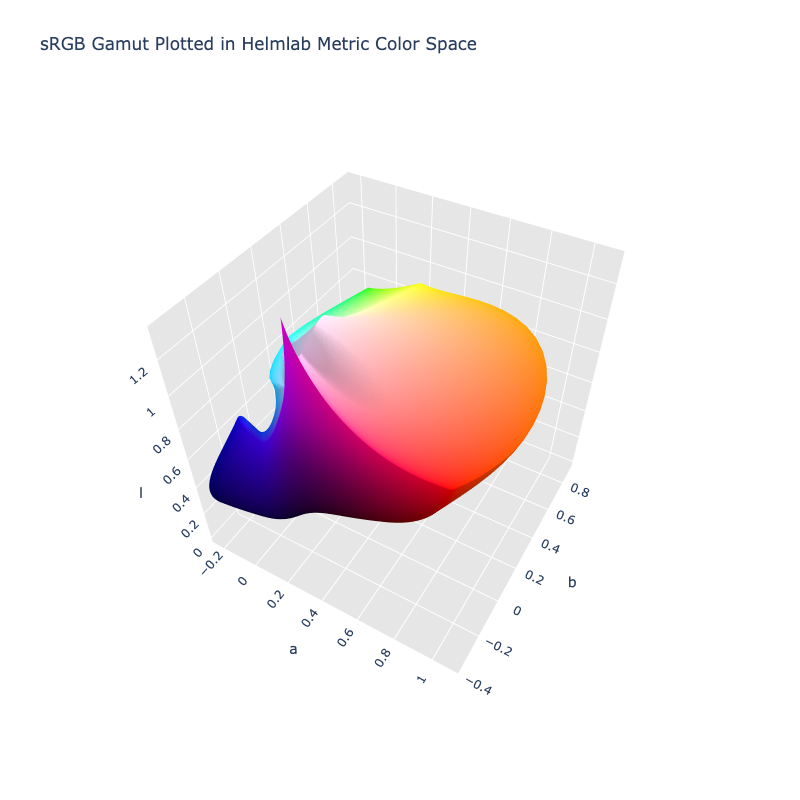

# Helmlab Metric

> [!failure] The Helmlab Metric color space is not registered in `Color` by default

/// html | div.info-container
> [!info | inline | end] Properties
> **Name:** `helmlab-metric`
>
> **White Point:** D65 / 2˚ (Variant from ASTM-E308)
>
> **Coordinates:**
>
> Name | Range^\*^
> ---- | -----
> `l`  | [0, ~1.6]
> `a`  | [-1.5, 1.5]
> `b`  | [-1.5, 1.5]
>
> ^\*^ Space is not bound to the range and is only used as a reference to define percentage inputs/outputs.


//// figure-caption
The sRGB gamut represented within the Helmlab Metric color space.
////

Helmlab is a family of purpose-built color spaces, two to be exact. The first is the Helmlab Metric space which is
designed for perceptual distance measurements, claiming STRESS 23.30 on COMBVD - 20% better than CIEDE2000. The second
is the Helmgen space which is designed for gradient and palette generation (60-8 vs Oklab on ColorBench's 83 metrics,
360/360/360 gamut cusps, zero monotonicity violations).

Helmlab Metric is the metric space and is specifically used for [color distancing](../distance.md#delta-e-helmlab) and
is not meant to be used for interpolation and palettes, and least not directly.

[Learn more](https://arxiv.org/abs/2602.23010).
///

## Channel Aliases

Channels | Aliases
-------- | -------
`l`      | `lightness`
`a`      |
`b`      |

**Inputs**

The Helmlab Metric space is not currently supported in the CSS spec, the parsed input and string output formats use the
`#!css-color color()` function format using the custom name `#!css-color --helmlab-metric`:

```css-color
color(--helmlab-metric l a b / a)  // Color function
```

The string representation of the color object and the default string output use the
`#!css-color color(--helmlab-metric l a b / a)` form.

```py play
Color("helmlab-metric", [0.9207, 0.94084, -0.2063])
Color("helmlab-metric", [1.0056, 0.80476, 0.71403]).to_string()
```

## Registering

```py
from coloraide import Color as Base
from coloraide.spaces.helmlab_metric import HelmlabMetric

class Color(Base): ...

Color.register(HelmlabMetric())
```
