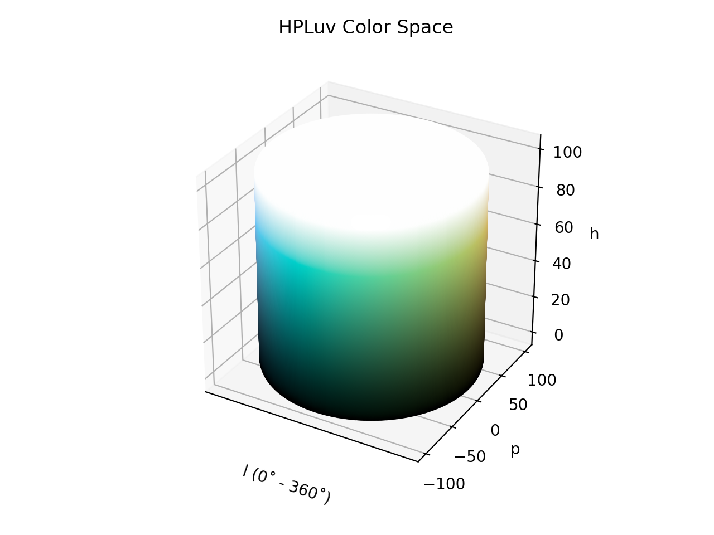

# HPLuv

!!! failure "The HPLuv color space is not registered in `Color` by default"

<div class="info-container" markdown>
!!! info inline end "Properties"

    **Name:** `hpluv`

    **Color CSS ID:** `--hpluv`

    **White Point:** D65

    **Coordinates:**

    Name | Range
    ---- | -----
    `h`  | [0, 360)
    `p`  | [0, 100]
    `l`  | [0, 100]

<figure markdown>



<figcaption markdown>
HSLuv color space in 3D
</figcaption>
</figure>

HPLuv is similar to [HSLuv](./hsluv.md) but takes as many colors as it can from [CIELCh~uv~](./lchuv.md) without
distorting the chroma. This ends up reducing the gamut to a subset of the sRGB gamut. In the end, only more pastel
colors remain.

_[Learn about HSLuv](https://www.hsluv.org/)_
</div>

## Channel Aliases

Channels    | Aliases
----------- | -------
`h`         | `hue`
`s`         | `perpendiculars`
`l`         | `lightness`

## Inputs/Output

HPLuv is not currently supported in the CSS spec, the parsed input and string output formats use the
`#!css-color color()` function format using the custom name `#!css-color --hpluv`:

```css-color
color(--hpluv h p l / a)  // Color function
```

When manually creating a color via raw data or specifying a color space as a parameter in a function, the color
space name is always used:

```py
Color("hpluv", [0, 0, 0], 1)
```

The string representation of the color object and the default string output use the
`#!css-color color(--hpluv h p l / a)` form.

```playground
Color("hpluv", [23.881, 100, 53.237])
Color("hpluv", [49.45, 100, 74.934]).to_string()
```

## Registering

```py
from coloraide import Color as Base
from coloraide.spaces.hpluv import HSPLuv

class Color(Base): ...

Color.register(HPLuv())
```
