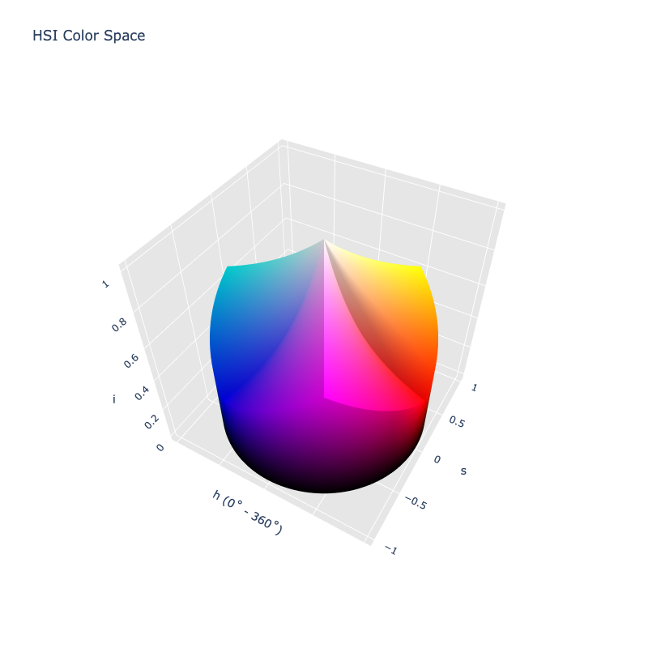
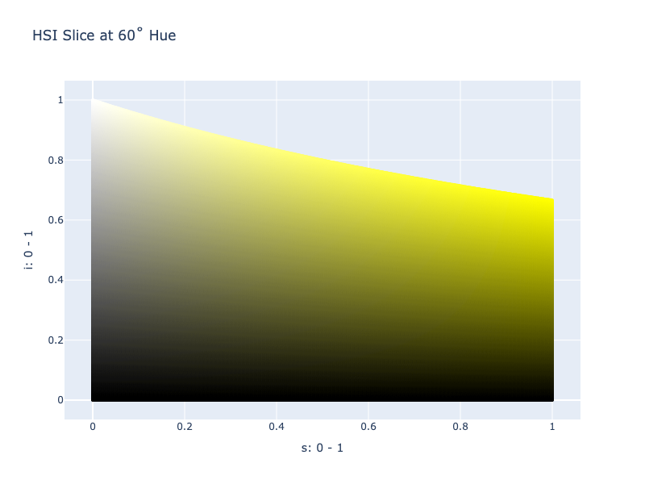

# HSI

/// failure | The HSI color space is not registered in `Color` by default
///

/// html | div.info-container
//// info | Properties
    attrs: {class: inline end}

**Name:** `hsi`

**White Point:** D65

**Coordinates:**

Name | Range
---- | -----
`h`  | [0, 360)
`s`  | [0, 1]
`i`  | [0, 1]
////

//// html | figure


///// html | figcaption
The sRGB gamut represented within the HSI color space.
/////
////

The HSI model is similar to models like HSL and HSV except that it uses I for intensity instead of Lightness or Value.
It does not attempt to "fill" a cylinder by its definition of saturation leading to a very different look when we plot
it.



[Learn more](https://en.wikipedia.org/wiki/HSL_and_HSV#HSI_to_RGB).
///

## Channel Aliases

Channels | Aliases
-------- | -------
`h`      | `hue`
`s`      | `saturation`
`i`      | `intensity`

## Input/Output

The HSI space is not currently supported in the CSS spec, the parsed input and string output formats use the
`#!css-color color()` function format using the custom name `#!css-color --hsi`:

```css-color
color(--hsi h s i / a)  // Color function
```

The string representation of the color object and the default string output use the
`#!css-color color(--hsi h s i / a)` form.

```py play
Color("hsi", [0, 1, 0.33333])
Color("hsi", [38.824, 1, 0.54902]).to_string()
```

## Registering

```py
from coloraide import Color as Base
from coloraide.spaces.hsi import HSI

class Color(Base): ...

Color.register(HSI())
```
