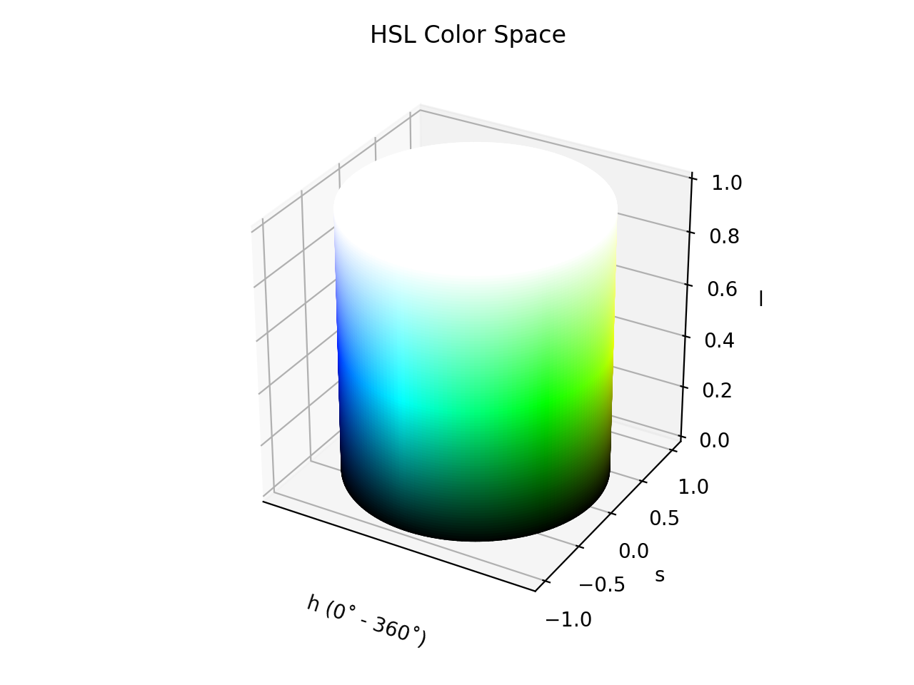

# HSL

!!! success "The HSL color space is registered in `Color` by default"

<div class="info-container" markdown>
!!! info inline end "Properties"

    **Name:** `hsl`

    **White Point:**   D65

    **Coordinates:**

    Name | Range
    ---- | -----
    `h`  | [0, 360)
    `s`  | [0, 1]
    `l`  | [0, 1]

<figure markdown>



<figcaption markdown>
HSL color space in 3D
</figcaption>
</figure>

HSL is an alternative representations of the [RGB](./srgb.md) color model, designed in the 1970s by computer graphics
researchers to more closely align with the way human vision perceives color-making attributes. In these models, colors
of each hue are arranged in a radial slice, around a central axis of neutral colors which ranges from black at the
bottom to white at the top.

HSL models the way different paints mix together to create color in the real world, with the lightness dimension
resembling the varying amounts of black or white paint in the mixture.

_[Learn about HSL](https://en.wikipedia.org/wiki/HSL_and_HSV)_
</div>

## Channel Aliases

Channels | Aliases
-------- | -------
`h`      | `hue`
`s`      | `saturation`
`l`      | `lightness`

## Input/Output

Parsed input and string output formats support all valid CSS forms. In addition, we also allow the `#!css-color 
color()` function format using the custom name `#!css-color --hsl`:

```css-color
hsl(h s l / a)          // HSL function
hsl(h, s, l)            // Legacy HSL function
hsla(h, s, l, a)        // Legacy HSLA function
color(--hsl h s l / a)  // Color function
```

When manually creating a color via raw data or specifying a color space as a parameter in a function, the color
space name is always used:

```py
Color("hsl", [0, 0, 0], 1)
```

The string representation of the color object will always default to the `#!css-color color(--hsl h s l / a)`
form, but the default string output will be the `#!css-color hsl(h s l / a)` form.

```playground
Color("hsl", [0, 1, 0.5])
Color("hsl", [38.824, 1, 0.5], ).to_string()
Color("hsl", [60, 1, 0.5]).to_string(comma=True)
Color("hsl", [120, 1, 0.25098]).to_string(color=True)
```

## Registering

```py
from coloraide import Color as Base
from coloraide.spaces.hsl import HSL

class Color(Base): ...

Color.register(HSL())
```
