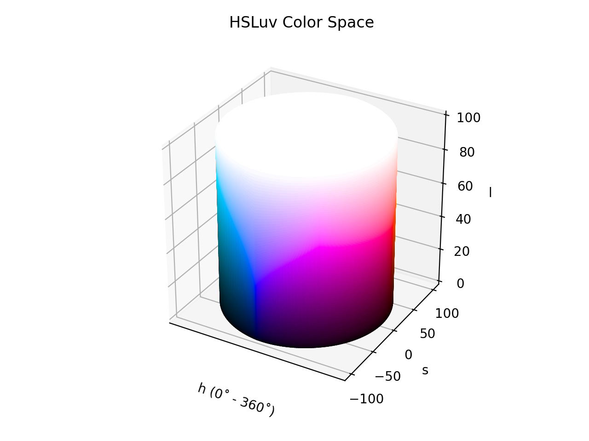

# HSLuv

/// failure | The HSLuv color space is not registered in `Color` by default
///

/// html | div.info-container
//// info | Properties
    attrs: {class: inline end}

**Name:** `hsluv`

**White Point:** D65

**Coordinates:**

Name | Range
---- | -----
`h`  | [0, 360)
`s`  | [0, 100]
`l`  | [0, 100]
////

//// html | figure


///// html | figcaption
HSLuv color space in 3D
/////
////

HSLuv is a human-friendly alternative to HSL. It was formerly known as "HUSL" and is a variation of the
[CIELCh~uv~](./lchuv.md) color space, where the chroma component is replaced by a saturation component which allows you
to span all the available chroma as a percentage. HSLuv is constrained to the sRGB gamut.

_[Learn about HSLuv](https://www.hsluv.org/)_
///

## Channel Aliases

Channels    | Aliases
----------- | -------
`h`         | `hue`
`s`         | `saturation`
`l`         | `lightness`

## Input/Output

HSLuv is not currently supported in the CSS spec, the parsed input and string output formats use the
`#!css-color color()` function format using the custom name `#!css-color --hsluv`:

```css-color
color(--hsluv h s l / a)  // Color function
```

When manually creating a color via raw data or specifying a color space as a parameter in a function, the color
space name is always used:

```py
Color("hsluv", [0, 0, 0], 1)
```

The string representation of the color object and the default string output use the
`#!css-color color(--hsluv h s l / a)` form.

```py play
Color("hsluv", [12.177, 100, 53.237])
Color("hsluv", [44.683, 100, 74.934]).to_string()
```

## Registering

```py
from coloraide import Color as Base
from coloraide.spaces.hsluv import HSLuv

class Color(Base): ...

Color.register(HSLuv())
```
