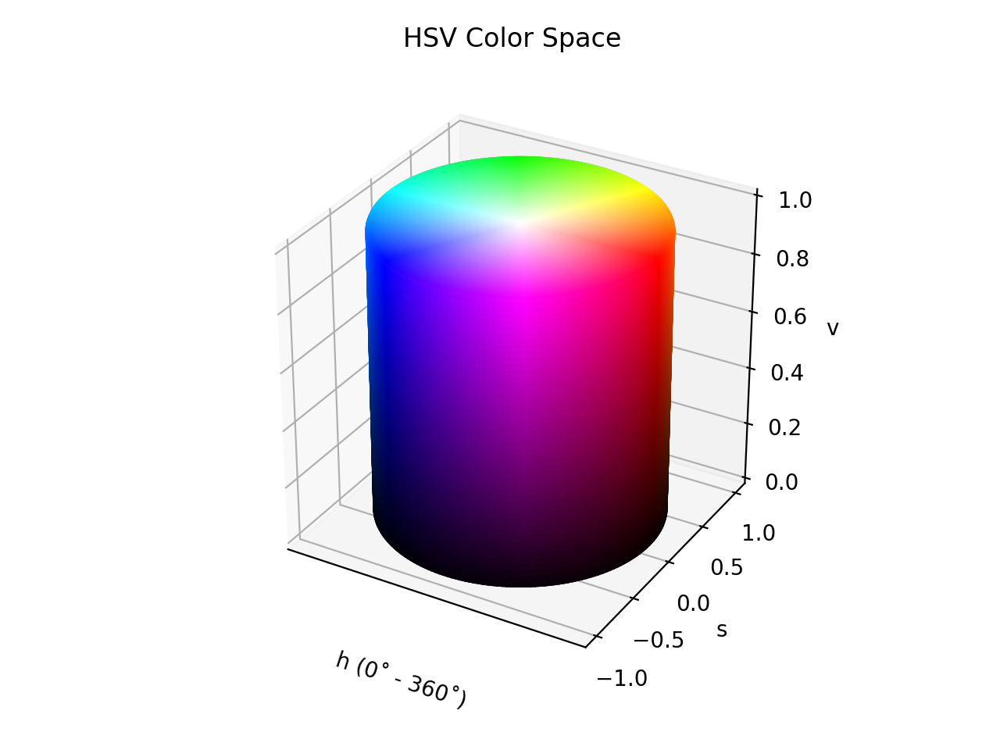

# HSV

!!! success "The HSV color space is registered in `Color` by default"

<div class="info-container" markdown>
!!! info inline end "Properties"

    **Name:** `hsv`

    **White Point:** D65

    **Coordinates:**

    Name | Range
    ---- | -----
    `h`  | [0, 360)
    `s`  | [0, 1]
    `v`  | [0, 1]

<figure markdown>



<figcaption markdown>
HSV color space in 3D
</figcaption>
</figure>

HSV is a color space similar to the modern [RGB](./srgb.md) and CMYK models. The HSV color space has three components: hue,
saturation and value. 'Value' is sometimes substituted with 'brightness' and then it is known as HSB. HSV models how
colors appear under light.

_[Learn about HSV](https://en.wikipedia.org/wiki/HSL_and_HSV)_
</div>

## Channel Aliases

Channels | Aliases
-------- | -------
`h`      | `hue`
`s`      | `saturation`
`v`      | `value`

## Input/Output

HSV is not supported via the CSS spec and the parser input and string output only supports the
`#!css-color color()` function format using the custom name `#!css-color --hsv`:

```css-color
color(--hsv 0 0% 0% / 1)
```

When manually creating a color via raw data or specifying a color space as a parameter in a function, the color
space name is always used:

```py
Color("hsv", [0, 0, 0], 1)
```

The string representation of the color object and default string output will always use the
`#!css-color color(hsv h s v / a)` form.

```playground
Color("hsv", [0, 1, 1])
Color("hsv", [38.824, 1, 1]).to_string()
```

## Registering

```py
from coloraide import Color as Base
from coloraide.spaces.hsv import HSV

class Color(Base): ...

Color.register(HSV())
```
