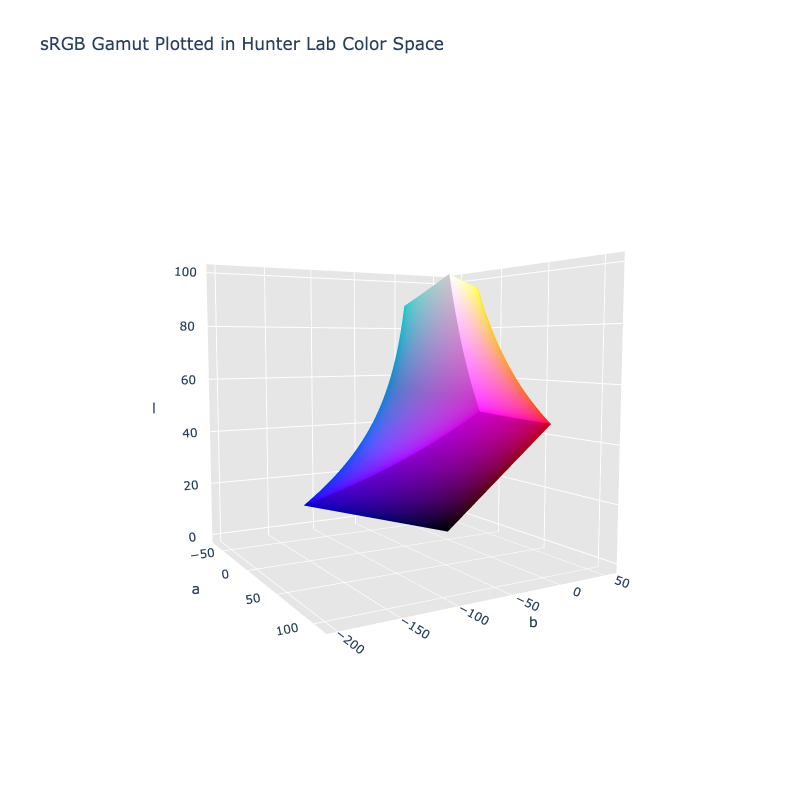

# Hunter Lab

/// failure | The Hunter Lab color space is not registered in `Color` by default
///

/// html | div.info-container
//// info | Properties
    attrs: {class: inline end}

**Name:** `hunter-lab`

**White Point:** D65

**Coordinates:**

Name | Range
---- | -----
`l`  | [0, 100]
`a`  | [-210, 210]
`b`  | [-210, 210]

^\*^ Space is not bound to the range and is only used as a reference to define percentage inputs/outputs in
relation to the Display P3 color space.
////

//// html | figure


///// html | figcaption
The sRGB gamut represented within the Hunter Lab color space.
/////
////

The Hunter Lab color space, defined in 1948 by Richard S. Hunter, is another color space referred to as "Lab". Like
CIELab, it was also designed to be computed via simple formulas from the CIE XYZ space, but to be more perceptually
uniform than CIE XYZ. Hunter named his coordinates L, a, and b. The CIE named the coordinates for CIELab as L*, a*, b* to
distinguish them from Hunter's coordinates.

[Learn more](https://support.hunterlab.com/hc/en-us/articles/203997095-Hunter-Lab-Color-Scale-an08-96a2).
///

## Channel Aliases

Channels | Aliases
-------- | -------
`l`      | `lightness`
`a`      |
`b`      |

## Input/Output

The Hunter Lab space is not currently supported in the CSS spec, the parsed input and string output formats use
the `#!css-color color()` function format using the custom name `#!css-color --hunter-lab`:

```css-color
color(--hunter-lab l a b / a)  // Color function
```

The string representation of the color object and the default string output use the
`#!css-color color(--hunter-lab l a b / a)` form.

```py play
Color("hunter-lab", [46.113, 82.672, 28.408])
Color("hunter-lab", [69.407, 23.266, 40.946]).to_string()
```

## Registering

```py
from coloraide import Color as Base
from coloraide.spaces.hunter_lab import HunterLab

class Color(Base): ...

Color.register(HunterLab())
```
