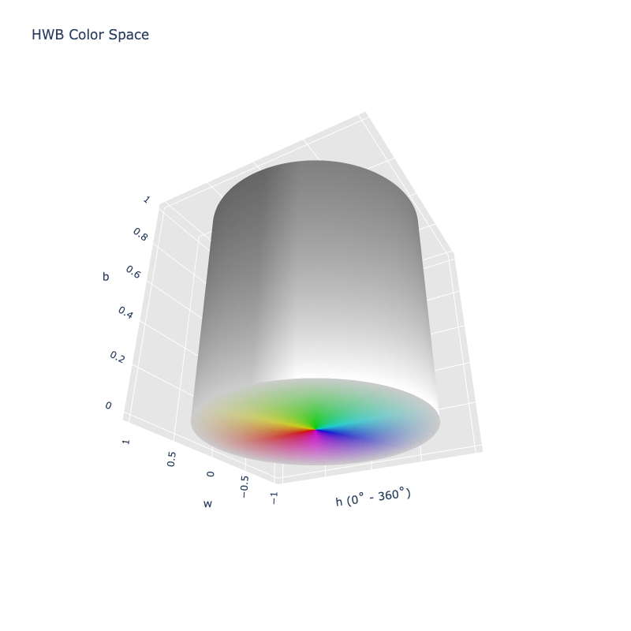

# HWB

/// success | The HWB color space is registered in `Color` by default
///

/// html | div.info-container
//// info | Properties
    attrs: {class: inline end}

**Name:** `hwb`

**White Point:** D65

**Coordinates:**

Name | Range
---- | -----
`h`  | [0, 360)
`w`  | [0, 1]
`b`  | [0, 1]
////

//// html | figure


///// html | figcaption
HWB color space in 3D
/////
////

HWB is a cylindrical-coordinate representation of points in an [RGB](./srgb.md) color model, similar to HSL and HSV. It
was developed by [HSV](./hsv.md)'s creator Alvy Ray Smith in 1996 to address some of the issues with HSV. HWB was
designed to be more intuitive for humans to use and slightly faster to compute. The first coordinate, H (Hue), is the
same as the Hue coordinate in [HSL](./hsl.md) and [HSV](./hsv.md). W and B stand for Whiteness and Blackness
respectively and range from 0-100% (or 0-1). The mental model is that the user can pick a main hue and then "mix" it
with white and/or black to produce the desired color.

_[Learn about HWB](https://en.wikipedia.org/wiki/HWB_color_model)_
///

## Channel Aliases

Channels    | Aliases
----------- | -------
`h`         | `hue`
`w`         | `whiteness`
`b`         | `blackness`

## Input/Output

Parsed input and string output formats support all valid CSS forms. In addition, we also allow the
`#!css-color color()` function format using the custom name `#!css-color --hwb`:

```css-color
hwb(h w b / a)          // HWB function
color(--hwb h w b / a)  // Color function
```

When manually creating a color via raw data or specifying a color space as a parameter in a function, the color
space name is always used:

```py
Color("hwb", [0, 0, 100], 1)
```

The string representation of the color object will always default to the `#!css-color color(--hwb h w b / a)`
form, but the default string output will be the `#!css-color hwb(h s l / a)` form.

```py play
Color("hwb", [0, 0, 0])
Color("hwb", [38.824, 0, 0]).to_string()
Color("hwb", [60, 0, 0]).to_string(percent=False)
Color("hwb", [120, 0, 0]).to_string(color=True)
```

## Registering

```py
from coloraide import Color as Base
from coloraide.spaces.hwb import HWB

class Color(Base): ...

Color.register(HWB())
```
