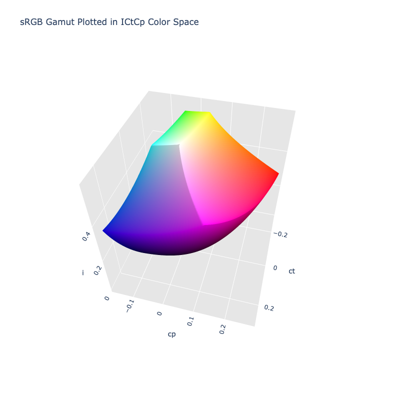

# ICtCp

!!! failure "The ICtCp color space is not registered in `Color` by default"

<div class="info-container" markdown>
!!! info inline end "Properties"

    **Name:** `ictcp`

    **White Point:** D65

    **Coordinates:**

    Name       | Range^\*^
    ---------- | ---------
    `i`        | [0, 1]
    `ct`       | [-0.5, 0.5]
    `cp`       | [-0.5, 0.5]

    ^\*^ Space is not bound to the range but is specified to enclose the full range of an HDR BT.2020 gamut and is used
    to define percentage inputs/outputs.

<figure markdown>



<figcaption markdown>
The sRGB gamut represented within the ICtCp color space.
</figcaption>
</figure>

ICtCp is a color space format with better perceptual uniformity than [CIELab](#cielab) and is used as a part of the
color image pipeline in video and digital photography systems for high dynamic range (HDR) and wide color gamut (WCG)
imagery. It was developed by Dolby Laboratories from the IPT color space by Ebner and Fairchild. It was designed with
the intention to replace YCbCr.

_[Learn about ICtCp](https://en.wikipedia.org/wiki/ICtCp)_
</div>

## Channel Aliases

Channels | Aliases
-------- | -------
`i`      | `intensity`
`ct`     | `tritan`
`cp`     | `protan`

## Input/Output

As ICtCp is not currently supported in the CSS spec, the parsed input and string output formats use the
`#!css-color color()` function format using the custom name `#!css-color --ictcp`:

```css-color
color(--ictcp i ct cp / a)  // Color function
```

When manually creating a color via raw data or specifying a color space as a parameter in a function, the color
space name is always used:

```py
Color("ictcp", [0, 0, 0], 1)
```

The string representation of the color object and the default string output use the
`#!css-color color(--ictcp i ct cp / a)` form.

```playground
Color("ictcp", [0.42785, -0.11574, 0.2788])
Color("ictcp", [0.50497, -0.20797, 0.11077]).to_string()
```

## Registering

```py
from coloraide import Color as Base
from coloraide.spaces.ictcp import ICtCp

class Color(Base): ...

Color.register(ICtCp())
```
