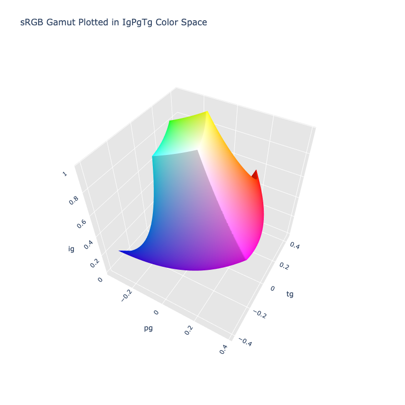

# IgPgTg

/// failure | The IgPgTg color space is not registered in `Color` by default
///

/// html | div.info-container
//// info | Properties
    attrs: {class: inline end}

**Name:** `ipt`

**White Point:** D65

**Coordinates:**

Name | Range
---- | -----
`ig` | [0, 1]
`pg` | [-1, 1]
`tg` | [-1, 1]

^\*^ Space is not bound to the range and is only used as a reference to define percentage inputs/outputs.
////

//// html | figure


///// html | figcaption
The sRGB gamut represented within the IgPgTg color space.
/////
////

IgPgTg uses the same structure as IPT, an established hue-uniform color space utilized in gamut mapping applications.
While IPT was fit to visual data on the perceived hue, IgPgTg was optimized based on evidence linking the peak
wavelength of Gaussian-shaped light spectra to their perceived hues.

[Learn more](https://www.researchgate.net/publication/21677980_Development_and_Testing_of_a_Color_Space_IPT_with_Improved_Hue_Uniformity.).
///

## Channel Aliases

Channels | Aliases
-------- | -------
`ig`     | `intensity`
`pg`     | `protan`
`tg`     | `tritan`

## Input/Output

The IgPgTg space is not currently supported in the CSS spec, the parsed input and string output formats use the
`#!css-color color()` function format using the custom name `#!css-color --igpgtg`:

```css-color
color(--igpgtg ig pg tg / a)  // Color function
```

The string representation of the color object and the default string output use the
`#!css-color color(--igpgtg ig pg tg / a)` form.

```py play
Color("igpgtg", [0.54834, 0.15366, 0.43674])
Color("igpgtg", [0.73238, 0.0397, 0.32108]).to_string()
```

## Registering

```py
from coloraide import Color as Base
from coloraide.spaces.igpgtg import IgPgTg

class Color(Base): ...

Color.register(IgPgTg())
```
