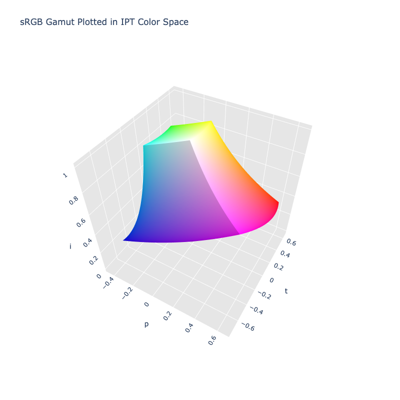

# IPT

> [!failure] The IPT color space is not registered in `Color` by default

/// html | div.info-container
> [!info | inline | end] Properties
> **Name:** `ipt`
>
> **White Point:** D65 / 2˚
>
> **Coordinates:**
>
> Name | Range^\*^
> ---- | -----
> `i`  | [0, 1]
> `p`  | [-1, 1]
> `t`  | [-1, 1]
>
> ^\*^ Space is not bound to the range and is only used as a reference to define percentage inputs/outputs.


//// figure-caption
The sRGB gamut represented within the IPT color space.
////

Ebner and Fairchild addressed the issue of non-constant lines of hue in their color space dubbed IPT. The IPT color
space converts D65-adapted XYZ data (XD65, YD65, ZD65) to long-medium-short cone response data (LMS) using an adapted
form of the Hunt-Pointer-Estevez matrix (M~HPE~(D65)).

The IPT color appearance model excels at providing a formulation for hue where a constant hue value equals a constant
perceived hue independent of the values of lightness and chroma (which is the general ideal for any color appearance
model, but hard to achieve). It is therefore well-suited for gamut mapping implementations.

> [!note]
> The D65 white point we use is the same one that IPT was defined to use: `#!py [0.9504, 1.0, 1.0889]`. This is the only
> D65 white point that will provide a clean transform from the white point to an LMS of `#!py [1.0, 1.0, 1.0]`, without
> adapting the transform to accomodate a different white point. It's possible that not all implementations use this D65
> white point and will not have clean conversions.

[Learn more](https://www.researchgate.net/publication/21677980_Development_and_Testing_of_a_Color_Space_IPT_with_Improved_Hue_Uniformity.).
///

## Channel Aliases

Channels | Aliases
-------- | -------
`i`      | `intensity`
`p`      | `protan`
`t`      | `tritan`

**Inputs**

The IPT space is not currently supported in the CSS spec, the parsed input and string output formats use the
`#!css-color color()` function format using the custom name `#!css-color --ipt`:

```css-color
color(--ipt i p t / a)  // Color function
```

The string representation of the color object and the default string output use the
`#!css-color color(--ipt i p t / a)` form.

```py play
Color("ipt", [0.45616, 0.62091, 0.44283])
Color("ipt", [0.64877, 0.18904, 0.53032]).to_string()
```

## Registering

```py
from coloraide import Color as Base
from coloraide.spaces.ipt import IPT

class Color(Base): ...

Color.register(IPT())
```
