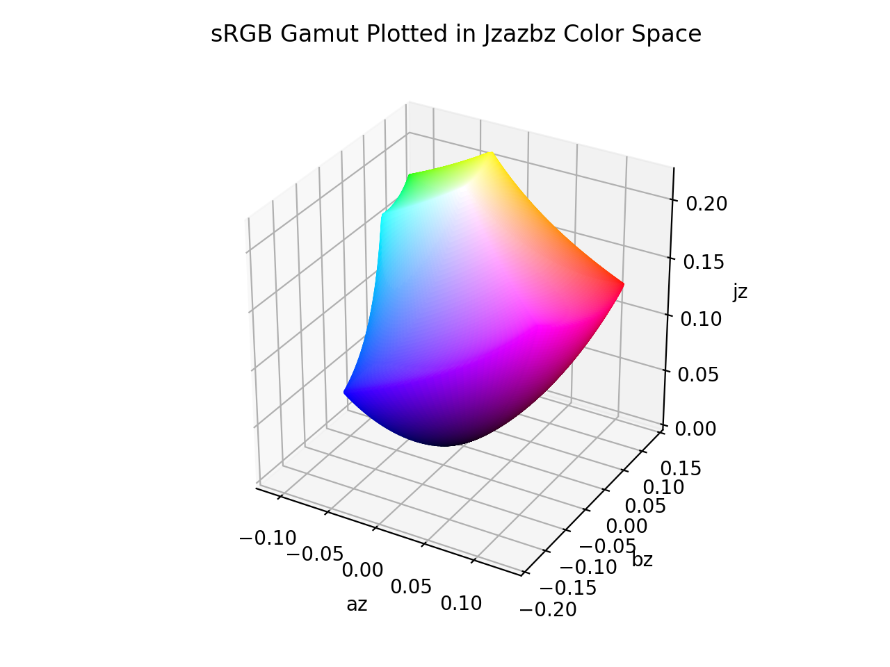

# Jzazbz

!!! failure "The Jzazbz color space is not registered in `Color` by default"

<div class="info-container" markdown>
!!! info inline end "Properties"

    **Name:** `jzazbz`

    **White Point:** D65

    **Coordinates:**

    Name | Range^\*^
    ---- | ---------
    `jz` | [0, 1]
    `az` | [-0.5, 0.5]
    `bz` | [-0.5, 0.5]

    ^\*^ Space is not bound to the range but is specified to enclose the full range of an HDR BT.2020 gamut and is used
    to define percentage inputs/outputs.

<figure markdown>



<figcaption markdown>
The sRGB gamut represented within the Jzazbz color space.
</figcaption>
</figure>

Jzazbz is a a color space designed for perceptual uniformity in high dynamic range (HDR) and wide color gamut (WCG)
applications. Conceptually it is similar to [CIELab](./lab.md), but claims the following improvements:

- Perceptual color difference is predicted by Euclidean distance.
- Perceptually uniform: MacAdam ellipses of just-noticeable-difference (JND) are more circular, and closer to the same
  sizes.
- Hue linearity: changing saturation or lightness has less shift in hue.

_[Learn about Jzazbz](https://www.osapublishing.org/oe/fulltext.cfm?uri=oe-25-13-15131&id=368272)_
</div>

## Channel Aliases

Channels | Aliases
-------- | -------
`jz`     | `lightness`
`az`     | `a`
`bz`     | `b`

## Input/Output

As Jzazbz is not currently supported in the CSS spec, the parsed input and string output formats use the
`#!css-color color()` function format using the custom name `#!css-color --jzazbz`:

```css-color
color(--jzazbz jz az bz / a)  // Color function
```

When manually creating a color via raw data or specifying a color space as a parameter in a function, the color
space name is always used:

```py
Color("jzazbz", [0, 0, 0], 1)
```

The string representation of the color object and the default string output use the
`#!css-color color(--jzazbz jz az bz / a)` form.

```playground
Color("jzazbz", [0.13438, 0.11789, 0.11188])
Color("jzazbz", [0.16937, 0.0312, 0.12308]).to_string()
```

## Registering

```py
from coloraide import Color as Base
from coloraide.spaces.jzazbz import Jzazbz

class Color(Base): ...

Color.register(Jzazbz())
```
