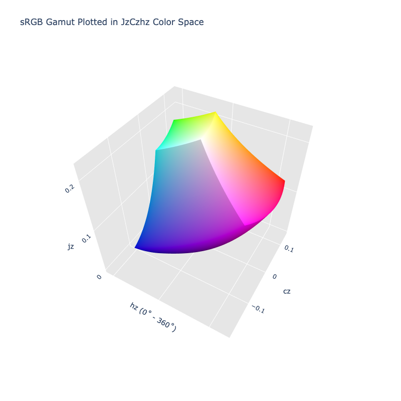

# JzCzhz

!!! failure "The JzCzhz color space is not registered in `Color` by default"

<div class="info-container" markdown>
!!! info inline end "Properties"

    **Name:** `jzczhz`

    **White Point:** D65

    **Coordinates:**

    Name | Range
    ---- | -----
    `jz` | [0, 1]
    `cz` | [0, 0.5]
    `hz` | [0, 360)

    ^\*^ Space is not bound to the range but is specified to enclose the full range of an HDR BT.2020 gamut and is used
    to define percentage inputs/outputs.

<figure markdown>



<figcaption markdown>
The sRGB gamut represented within the JzCzhz color space.
</figcaption>
</figure>

JzCzhz is the cylindrical form of [Jzazbz](./jzazbz.md).

_[Learn about JzCzhz](https://www.osapublishing.org/oe/fulltext.cfm?uri=oe-25-13-15131&id=368272)_
</div>

## Channel Aliases

Channels | Aliases
-------- | -------
`jz`     | `lightness`
`cz`     | `chroma`
`hz`     | `hue`

## Input/Output

As JzCzhz is not currently supported in the CSS spec, the parsed input and string output formats use the
`#!css-color color()` function format using the custom name `#!css-color --jzczhz`:

```css-color
color(--jzczhz jz cz hz / a)  // Color function
```

When manually creating a color via raw data or specifying a color space as a parameter in a function, the color
space name is always used:

```py
Color("jzczhz", [0, 0, 0], 1)
```

The string representation of the color object and the default string output use the
`#!css-color color(--jzczhz jz cz hz / a)` form.

```playground
Color("jzczhz", [0.13438, 0.16252, 43.502])
Color("jzczhz", [0.16937, 0.12698, 75.776]).to_string()
```

## Registering

```py
from coloraide import Color as Base
from coloraide.spaces.jzczhz import JzCzhz

class Color(Base): ...

Color.register(JzCzhz())
```
