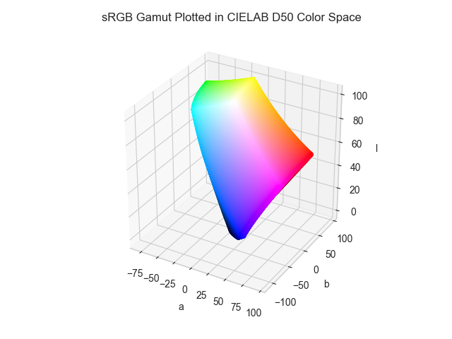

# LAB D50

!!! success "The Lab D50 color space is registered in `Color` by default"

<div class="info-container" markdown>
!!! info inline end "Properties"

    **Name:** `lab`

    **White Point:** D50

    **Coordinates:**

    Name | Range^\*^
    ---- | ---------
    `l`  | [0, 100]
    `a`  | [-125, 125]
    `b`  | [-125, 125]

    ^\*^ Space is not bound to the range and is only used as a reference to define percentage inputs/outputs in
    relation to the Display P3 color space.

<figure markdown>



<figcaption markdown>
The sRGB gamut represented within the CIELab D50 color space.
</figcaption>
</figure>

The CIELab color space also referred to as L\*a\*b\* is a color space defined by the International Commission on
Illumination (abbreviated CIE) in 1976. It expresses color as three values: L\* for perceptual lightness, and a\* and
b\* for the four unique colors of human vision: red, green, blue, and yellow. CIELab was intended as a perceptually
uniform space, where a given numerical change corresponds to similar perceived change in color. While the CIELab space
is not truly perceptually uniform, it nevertheless is useful in industry for detecting small differences in color.

_[Learn about CIELab](https://en.wikipedia.org/wiki/CIELab_color_space)_
</div>

## Channel Aliases

Channels | Aliases
-------- | -------
`l`      | `lightness`
`a`      |
`b`      |

## Input/Output

Parsed input and string output formats support all valid CSS forms. In addition, we also allow the
`#!css-color color()` function format using the custom name `#!css-color --lab`:

```css-color
lab(l a b / a)          // Lab function
color(--lab l a b / a)  // Color function
```

When manually creating a color via raw data or specifying a color space as a parameter in a function, the color
space name is always used:

```py
Color("lab", [0, 0, 0], 1)
```

The string representation of the color object will always default to the `#!css-color color(--lab l a b / a)`
form, but the default string output will be the `#!css-color lab(l a b / a)` form.

```playground
Color("lab", [54.291, 80.805, 69.891])
Color("lab", [75.59, 27.516, 79.121]).to_string()
Color("lab", [97.607, -15.75, 93.394]).to_string(percent=True)
Color("lab", [46.278, -47.552, 48.586]).to_string(color=True)
```

## Registering

```py
from coloraide import Color as Base
from coloraide.spaces.lab import Lab

class Color(Base): ...

Color.register(Lab())
```
