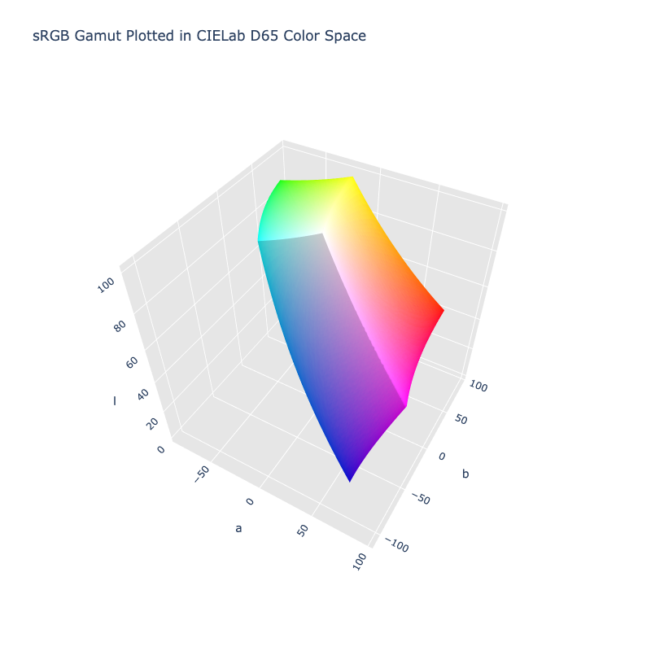

# Lab D65

!!! success "The Lab D65 color space is registered in `Color` by default"

<div class="info-container" markdown>
!!! info inline end "Properties"

    **Name:** `lab-d65`

    **White Point:** D65

    **Coordinates:**

    Name | Range^\*^
    ---- | ---------
    `l`  | [0, 100]
    `a`  | [-130, 130]
    `b`  | [-130, 130]

    ^\*^ Space is not bound to the range and is only used as a reference to define percentage inputs/outputs in
    relation to the Display P3 color space.

<figure markdown>



<figcaption markdown>
The sRGB gamut represented within the CIELab D50 color space.
</figcaption>
</figure>

CIELab D65 is the same as [CIELab](./lab.md) except it uses a D65 white point.

_[Learn about CIELab](https://en.wikipedia.org/wiki/CIELab_color_space)_
</div>

## Channel Aliases

Channels | Aliases
-------- | -------
`l`      | `lightness`
`a`      |
`b`      |

## Input/Output

As a D65 variant of CIELab is not currently supported in the CSS spec, the parsed input and string output
formats use the `#!css-color color()` function format using the custom name `#!css-color --lab-d65`:

```css-color
color(--lab-d65 l a b / a)  // Color function
```

When manually creating a color via raw data or specifying a color space as a parameter in a function, the color
space name is always used:

```py
Color("lab-d65", [0, 0, 0], 1)
```

The string representation of the color object and the default string output use the
`#!css-color color(--lab-d65 l a b / a)` form.

```playground
Color("lab-d65", [53.237, 80.09, 67.203])
Color("lab-d65", [74.934, 23.927, 78.953]).to_string()
```

## Registering

```py
from coloraide import Color as Base
from coloraide.spaces.lab_d65 import LabD65

class Color(Base): ...

Color.register(LabD65())
```
