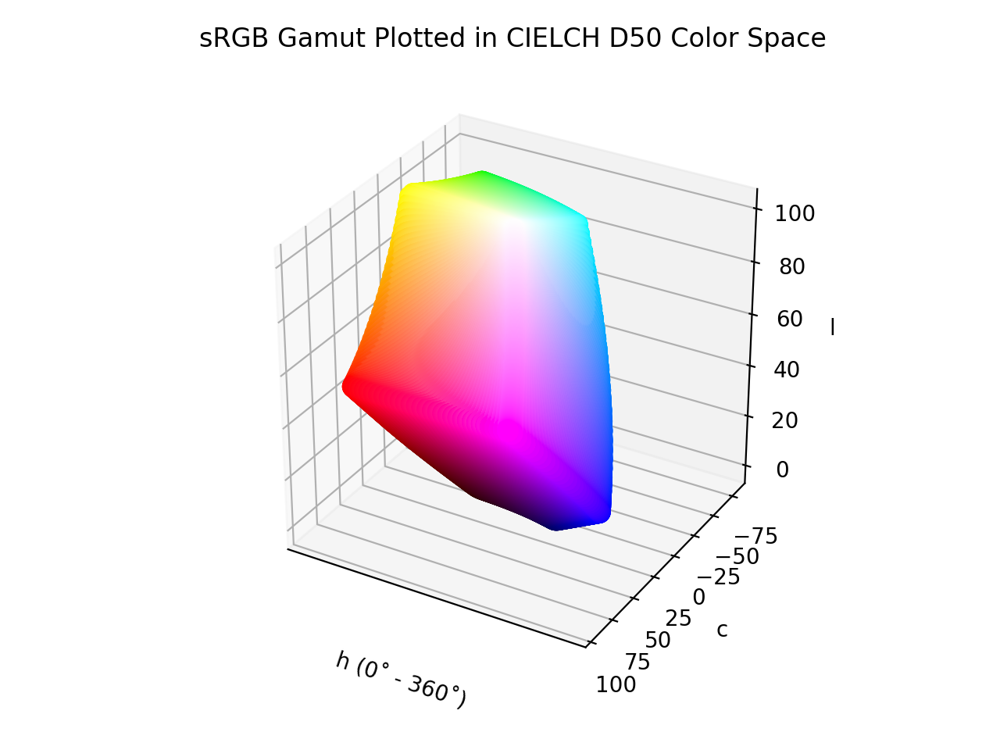

# LCh D50

!!! success "The LCh D50 color space is registered in `Color` by default"

<div class="info-container" markdown>
!!! info inline end "Properties"

    **Name:** `lch`

    **White Point:** D50

    **Coordinates:**

    Name | Range^\*^
    ---- | ---------
    `l`  | [0, 100]
    `c`  | [0, 150]
    `h`  | [0, 360)

    ^\*^ Space is not bound to the range and is only used as a reference to define percentage inputs/outputs in
    relation to the Display P3 color space.

<figure markdown>



<figcaption markdown>
The sRGB gamut represented within the CIELCh D50 color space.
</figcaption>
</figure>

The "CIELCh" space is a color space based on [CIELab](./lab.md), which uses the polar coordinates C\* (chroma, relative
saturation) and h&deg; (hue angle, angle of the hue in the CIELab color wheel) instead of the Cartesian
coordinates a\* and b\*. The CIELab lightness L\* remains unchanged.

_[Learn about CIELCh](https://en.wikipedia.org/wiki/CIELab_color_space#Cylindrical_representation:_CIELCh_or_CIEHLC)_
</div>

## Channel Aliases

Channels | Aliases
-------- | -------
`l`      | `lightness`
`c`      | `chroma`
`h`      | `hue`

## Input/Output

Parsed input and string output formats support all valid CSS forms. In addition, we also allow the
`#!css-color color()` function format using the custom name `#!css-color --lch`:

```css-color
lch(l c h / a)          // LCh function
color(--lch l c h / a)  // Color function
```

When manually creating a color via raw data or specifying a color space as a parameter in a function, the color
space name is always used:

```py
Color("lch", [0, 0, 0], 1)
```

The string representation of the color object will always default to the `#!css-color color(--lch l c h / a)`
form, but the default string output will be the `#!css-color lch(l c h / a)` form.

```playground
Color("lch", [54.291, 106.84, 40.858])
Color("lch", [75.59, 83.769, 70.824]).to_string()
Color("lch", [97.607, 94.712, 99.572]).to_string(percent=True)
Color("lch", [46.278, 67.984, 134.38]).to_string(color=True)
```

## Registering

```py
from coloraide import Color as Base
from coloraide.spaces.lch import LCh

class Color(Base): ...

Color.register(LCh())
```
