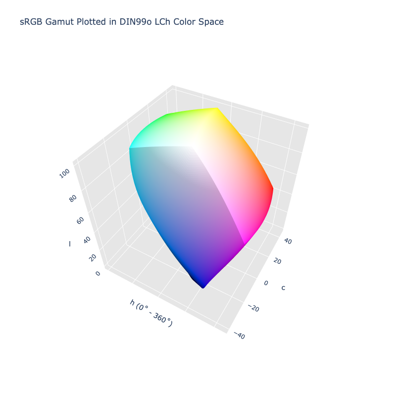

# DIN99o LCh

!!! failure "The DIN99o LCh color space is not registered in `Color` by default"

<div class="info-container" markdown>
!!! info inline end "Properties"

    **Name:** `lch99o`

    **White Point:** D65

    **Coordinates:**

    Name | Range^\*^
    ---- | ---------
    `l`  | [0, 100]
    `c`  | [0, 60]
    `h`  | [0, 360)

    ^\*^ Space is not bound to the range and is only used as a reference to define percentage inputs/outputs in
    relation to the Display P3 color space.

<figure markdown>



<figcaption markdown>
The sRGB gamut represented within the DIN99o LCh color space.
</figcaption>
</figure>

DIN99o LCh is the cylindrical form of [DIN99o](./din99o.md).

_[Learn about DIN99o LCh](https://de.wikipedia.org/wiki/DIN99-Farbraum)_
</div>

## Channel Aliases

Channels | Aliases
-------- | -------
`l`      | `lightness`
`c`      | `chroma`
`h`      | `hue`

## Input/Output

As DIN99o LCh is not currently supported in the CSS spec, the parsed input and string output formats use the
`#!css-color color()` function format using the custom name `#!css-color --lch99o`:

```css-color
color(--lch99o jz cz hz / a)  // Color function
```

When manually creating a color via raw data or specifying a color space as a parameter in a function, the color
space name is always used:

```py
Color("lch99o", [0, 0, 0], 1)
```

The string representation of the color object and the default string output use the
`#!css-color color(--lch99o jz cz hz / a)` form.

```playground
Color("lch99o", [57.289, 49.915, 37.692])
Color("lch99o", [77.855, 43.543, 67.811]).to_string()
```

## Registering

```py
from coloraide import Color as Base
from coloraide.spaces.lch99o import LCh99o

class Color(Base): ...

Color.register(LCh99o())
```
