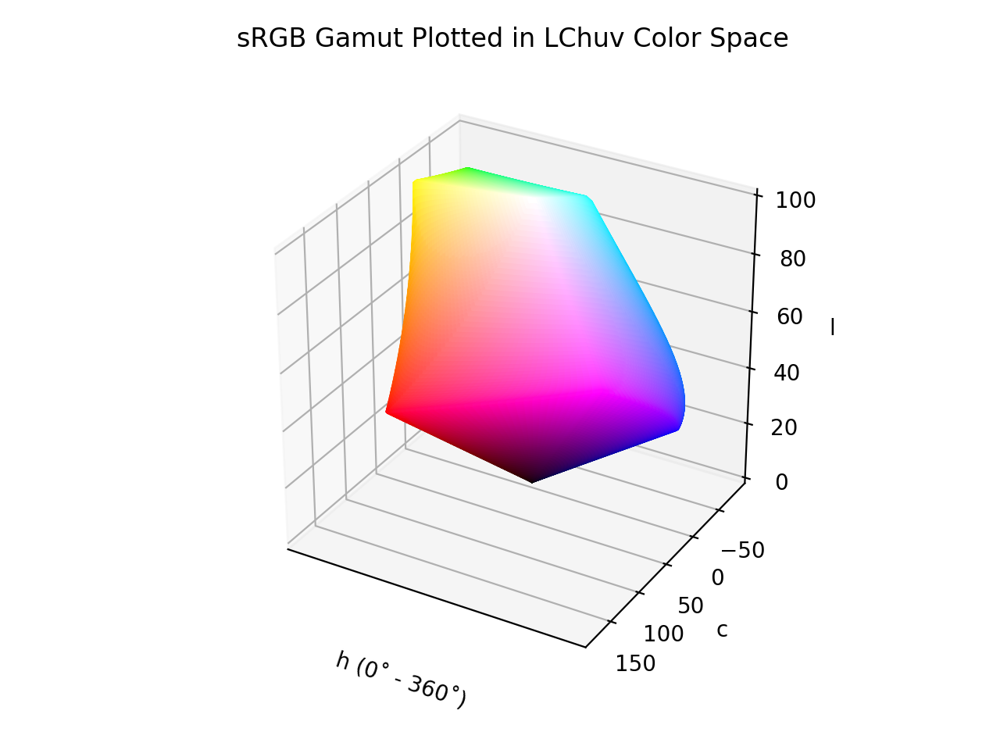

# LCh~uv~

!!! failure "The LCH~uv~ color space is not registered in `Color` by default"

<div class="info-container" markdown>
!!! info inline end "Properties"

    **Name:** `lchuv`

    **White Point:** D65

    **Coordinates:**

    Name | Range^\*^
    ---- | ---------
    `l`  | [0, 100]
    `c`  | [0, 220]
    `h`  | [0, 360)

    ^\*^ Space is not bound to the range and is only used as a reference to define percentage inputs/outputs in
    relation to the Display P3 color space.

<figure markdown>



<figcaption markdown>
The sRGB gamut represented within the CIELCh~uv~ color space.
</figcaption>
</figure>

[CIELuv](./luv.md) is not an intuitive space to work with directly and instead is often converted to cylindrical
coordinates with hues represented as degrees and a chroma and lightness channel. The shape of the color space doesn't
really change, just how the colors are manipulated.

_[Learn about CIELCh~uv~](https://en.wikipedia.org/wiki/CIELuv)_
</div>

## Channel Aliases

Channels | Aliases
-------- | -------
`l`      | `lightness`
`c`      | `chroma`
`h`      | `hue`

## Input/Output

As CIELCh~uv~ is not currently supported in the CSS spec, the parsed input and string output formats use the
`#!css-color color()` function format using the custom name `#!css-color --lchuv`:

```css-color
color(--lchuv l c h / a)  // Color function
```

When manually creating a color via raw data or specifying a color space as a parameter in a function, the color
space name is always used:

```py
Color("lchuv", [0, 0, 0], 1)
```

The string representation of the color object and the default string output use the
`#!css-color color(--lchuv l c h / a)` form.

```playground
Color("lchuv", [53.237, 179.04, 12.177])
Color("lchuv", [74.934, 105.26, 44.683]).to_string()
```

## Registering

```py
from coloraide import Color as Base
from coloraide.spaces.lchuv import LChuv

class Color(Base): ...

Color.register(LChuv())
```
