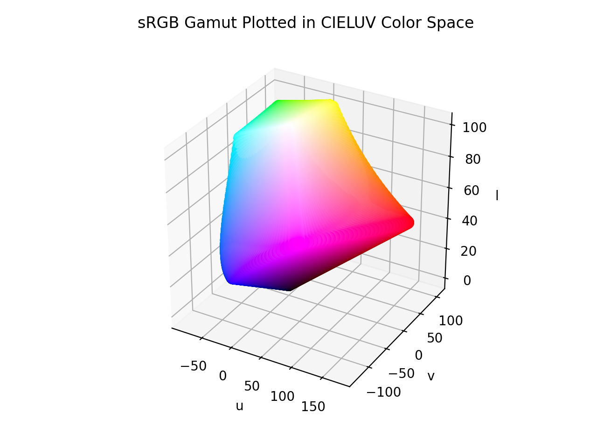

# Luv

!!! failure "The Luv color space is not registered in `Color` by default"

<div class="info-container" markdown>
!!! info inline end "Properties"

    **Name:** `luv`

    **White Point:** D65

    **Coordinates:**

    Name | Range^\*^
    ---- | ---------
    `l`  | [0, 100]
    `u`  | [-215, 215]
    `v`  | [-215, 215]

    ^\*^ Space is not bound to the range and is only used as a reference to define percentage inputs/outputs in
    relation to the Display P3 color space.

<figure markdown>



<figcaption markdown>
The sRGB gamut represented within the CIELuv D65 color space.
</figcaption>
</figure>

CIELuv is similar to CIELab as they were both developed in 1976 as perceptually uniform color spaces, both are derived
from the color experiments in 1931 that brought us the XYZ color space, and neither are truly perceptually uniform.

The difference between the two comes from their intent. CIELab attempted to create a space that aligned well with
human vision. CIELuv, on the other hand, was designed to be an easier-to-compute transformation of the 1931 CIE XYZ
color space.

CIELab is more commonly used in subtractive color applications (printed pages, dyes, etc.), while CIELuv is better
suited in additive color applications such as display colorimetry (monitors, TVs, etc.).

_[Learn about CIELuv](https://en.wikipedia.org/wiki/CIELuv)_
</div>

## Channel Aliases

Channels | Aliases
-------- | -------
`l`      | `lightness`
`u`      |
`v`      |

## Input/Output

As CIELuv D65 is not currently supported in the CSS spec, the parsed input and string output formats use the
`#!css-color color()` function format using the custom name `#!css-color --luv`:

```css-color
color(--luv l u v / a)  // Color function
```

When manually creating a color via raw data or specifying a color space as a parameter in a function, the color
space name is always used:

```py
Color("luv", [0, 0, 0], 1)
```

The string representation of the color object and the default string output use the
`#!css-color color(--luv l u v / a)` form.

```playground
Color("luv", [53.237, 175.01, 37.765])
Color("luv", [74.934, 74.839, 74.014]).to_string()
```

## Registering

```py
from coloraide import Color as Base
from coloraide.spaces.luv import Luv

class Color(Base): ...

Color.register(Luv())
```
