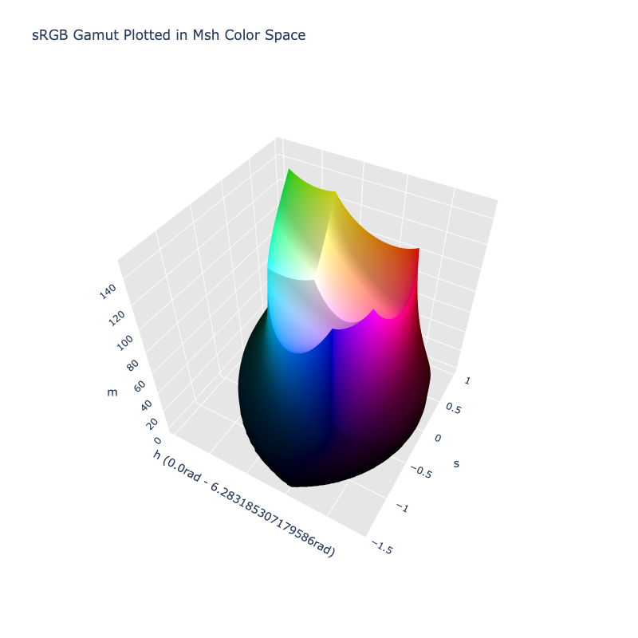

# Msh

/// failure | The Msh color space is not registered in `Color` by default
///

/// html | div.info-container
//// info | Properties
    attrs: {class: inline end}

**Name:** `msh`

**White Point:** D65 / 2˚

**Coordinates:**

Name | Range^\*^
---- | ---------
`m`  | [0, 179.95]
`s`  | [0, 1.6]
`h`  | [0, 6.283]

^\*^ Space is not bound to the range and is only used as a reference to define percentage inputs/outputs in
relation to the Display P3 color space.
////


//// figure-caption
The sRGB gamut represented within the Msh color space.
////

The Msh color space is a polar transform of the [CIELab](./lab.md) color space developed by Kenneth Moreland. The
space aims to help provide better color map for 3D scientific visualizations, specifically divergent color maps, by
reducing Mach bands.

/// note | Hue Units
While most polar spaces represent hue in degrees, the Msh paper actually defines hues in units of radians. When using
Msh, it is important to be aware of this quirk. When serializing in CSS, you can specify the degree form via
`#!color color(--msh 80 1.08 40deg)`, but the channel is stored in radians by default:
`#!color Color('color(--msh 80 1.08 40deg)').normalize()`.
///

_[Learn about Msh](https://www.kennethmoreland.com/color-maps/ColorMapsExpanded.pdf)_
///

## Channel Aliases

Channels | Aliases
-------- | -------
`m`      | `magnitude`
`s`      | `saturation`
`h`      | `hue`

## Input/Output

The Msh space is not currently supported in the CSS spec, the parsed input and string output formats use
the `#!css-color color()` function format using the custom name `#!css-color --msh`:

```css-color
color(--msh m s h / a)  // Color function
```

When manually creating a color via raw data or specifying a color space as a parameter in a function, the color
space name is always used:

```py
Color("msh", [0, 0, 0], 1)
```

The string representation of the color object and the default string output use the
`#!css-color color(--msh m s h / a)` form.

```py play
Color("msh", [117.32, 1.0998, 0.69813])
Color("msh", [111.45, 0.83341, 1.2765]).to_string()
```

## Registering

```py
from coloraide import Color as Base
from coloraide.spaces.msh import Msh

class Color(Base): ...

Color.register(Msh())
```

## Creating Divergent Color Maps

The ["Diverging Color Maps for Scientific Visualization (Expanded)"](https://www.kennethmoreland.com/color-maps/ColorMapsExpanded.pdf)
paper by Kenneth Moreland outlines an approach to creating _better_ divergent color maps utilizing Msh. It takes two end
colors and will inject white between the colors if neither of the sides is unsaturated. It then adjusts the unsaturated
color's hue to ensure a smooth transition by adding some "spin" in the radial direction to avoid things like a purple
shift in blue.

```py play
import math
from coloraide import stop


def prepare_msh_divergent_interpolation(c1, c2):
    """Optimize colors for interpolation."""

    hue_cutoff = math.pi / 3

    def rad_diff(r1, r2):
        """Get the radian difference."""

        diff = abs(r1 - r2)
        return min(diff, math.tau - diff)

    def adjust_hue(msh_sat, m_unsat):
        """Adjust hue."""

        m_sat, s_sat, h_sat = msh_sat

        if m_sat >= m_unsat:
            return h_sat
        else:
            h_spin = s_sat * math.sqrt(m_unsat ** 2 - m_sat ** 2) / (m_sat * math.sin(s_sat))
            if h_sat > -hue_cutoff:
                return h_sat + h_spin
            else:
                return h_sat - h_spin

    # Normalize values and and remove NaNs.
    c1 = Color(c1).convert('msh', norm=False).normalize(nans=False)
    c2 = Color(c2).convert('msh', norm=False).normalize(nans=False)

    # Msh interpolation logic expects values above 180 degrees (or PI) to be negative.
    if c1['h'] > math.pi:
        c1['h'] -= math.tau
    if c2['h'] > math.pi:
        c2['h'] -= math.tau

    # Insert white between saturated colors
    colors = [c1]
    if (c1['s'] > 0.05) and (c2['s'] > 0.05) and (rad_diff(c1['h'], c2['h']) > hue_cutoff):
        mid = max(c1['m'], c2['m'], 88.0)
        colors.append(Color('msh', [mid, 0.0, 0.0]))
        colors.append(Color('msh', [mid, 0.0, 0.0]))
    colors.append(c2)

    # Adjust hue of unsaturated colors.
    if (colors[0]['s'] < 0.05) and (colors[1]['s'] > 0.05):
        colors[0]['h'] = adjust_hue(colors[1].coords(), colors[0]['m'])
    elif (colors[1]['s'] < 0.05) and (colors[0]['s'] > 0.05):
        colors[1]['h'] = adjust_hue(colors[0].coords(), colors[1]['m'])

    # If white was inserted, adjust hues of unsaturated color on the right side.
    if len(colors) > 2:
        if (colors[-2]['s'] < 0.05) and (colors[-1]['s'] > 0.05):
            colors[-2]['h'] = adjust_hue(colors[-1].coords(), colors[-2]['m'])
        elif (colors[-1]['s'] < 0.05) and (colors[-2]['s'] > 0.05):
            colors[-1]['h'] = adjust_hue(colors[-2].coords(), colors[-1]['m'])
        colors[1] = stop(colors[1], 0.5)
        colors[-2] = stop(colors[-2], 0.5)

    return colors


Color.interpolate(
    prepare_msh_divergent_interpolation(
        Color('srgb', [0.230, 0.299, 0.754]),
        Color('srgb', [0.706, 0.016, 0.150])
    ),
    space='msh',
    out_space='srgb'
)

Color.interpolate(
    prepare_msh_divergent_interpolation(
        Color('srgb', [0.436, 0.308, 0.631]),
        Color('srgb', [0.759, 0.334, 0.046])
    ),
    space='msh',
    out_space='srgb'
)

Color.interpolate(
    prepare_msh_divergent_interpolation(
        Color('srgb', [0.085, 0.532, 0.201]),
        Color('srgb', [0.436, 0.308, 0.631])
    ),
    space='msh',
    out_space='srgb'
)

Color.interpolate(
    prepare_msh_divergent_interpolation(
        Color('srgb', [0.217, 0.525, 0.910]),
        Color('srgb', [0.677, 0.492, 0.093])
    ),
    space='msh',
    out_space='srgb'
)

Color.interpolate(
    prepare_msh_divergent_interpolation(
        Color('srgb', [0.085, 0.532, 0.201]),
        Color('srgb', [0.758, 0.214, 0.233])
    ),
    space='msh',
    out_space='srgb'
)
```
