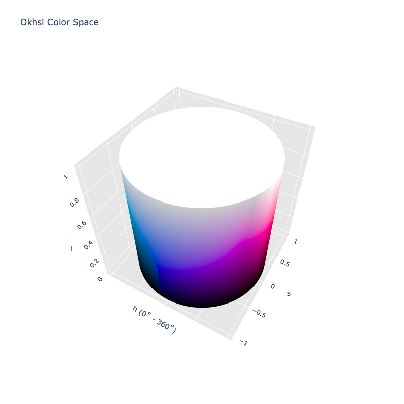

# Okhsl

!!! failure "The Okhsl color space is not registered in `Color` by default"

<div class="info-container" markdown>
!!! info inline end "Properties"

    **Name:** `okhsl`

    **White Point:** D65

    **Coordinates:**

    Name | Range
    ---- | -----
    `h`  | [0, 360)
    `s`  | [0, 1]
    `l`  | [0, 1]

<figure markdown>



<figcaption markdown>
Okhsl color space in 3D
</figcaption>
</figure>

Okhsl is a another color space created by Björn Ottosson. It is based off his early work and leverages the
[Oklab](./oklab.md) color space. The aim was to create a color space that was better suited for being used in color pickers
than the current HSL.

_[Learn about Okhsv](https://bottosson.github.io/posts/colorpicker/)_
</div>

## Channel Aliases

Channels    | Aliases
----------- | -------
`h`         | `hue`
`s`         | `saturation`
`l`         | `lightness`

## Input/Output

Okhsl is not currently supported in the CSS spec, the parsed input and string output formats use the
`#!css-color color()` function format using the custom name `#!css-color --okhsl`:

```css-color
color(--okhsl h s l / a)  // Color function
```

When manually creating a color via raw data or specifying a color space as a parameter in a function, the color
space name is always used:

```py
Color("okhsl", [0, 0, 0], 1)
```

The string representation of the color object and the default string output use the
`#!css-color color(--okhsl h s l / a)` form.

```playground
Color("okhsl", [29.234, 1, 0.56808], 1)
Color("okhsl", [70.67, 1, 0.75883], 1).to_string()
```

## Registering

```py
from coloraide import Color as Base
from coloraide.spaces.okhsl import Okhsl

class Color(Base): ...

Color.register(Okhsl())
```
