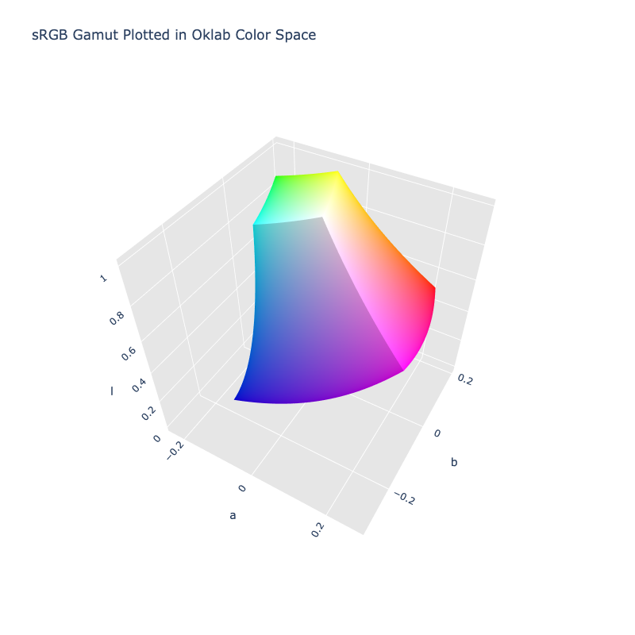

# Oklab

/// success | The Oklab color space is registered in `Color` by default
///

/// html | div.info-container
//// info | Properties
    attrs: {class: inline end}

**Name:** `oklab`

**White Point:** D65

**Coordinates:**

Name | Range^\*^
---- | ---------
`l`  | [0, 1]
`a`  | [-0.4, 0.4]
`b`  | [-0.4, 0.4]

^\*^ Space is not bound to the range and is only used as a reference to define percentage inputs/outputs in
relation to the Display P3 color space.
////

//// html | figure


///// html | figcaption
The sRGB gamut represented within the Oklab color space.
/////
////


A new perceptual color space that claims to be simple to use, while doing a good job at predicting perceived lightness,
chroma and hue. It is called the Oklab color space, because it is an OK Lab color space.

_[Learn about Oklab](https://bottosson.github.io/posts/oklab/)_
///

## Channel Aliases

Channels | Aliases
-------- | -------
`l`      | `lightness`
`a`      |
`b`      |

## Input/Output

Oklab is not currently supported in the CSS spec, the parsed input and string output formats use the
`#!css-color color()` function format using the custom name `#!css-color --oklab`:

```css-color
oklab(l a b / a)          // Oklab function
color(--oklab l a b / a)  // Color function
```

When manually creating a color via raw data or specifying a color space as a parameter in a function, the color
space name is always used:

```py
Color("oklab", [0, 0, 0], 1)
```

The string representation of the color object will always default to the `#!css-color color(--oklab l a b / a)`
form, but the default string output will be the `#!css-color oklab(l a b / a)` form.

```py play
Color("oklab", [0.62796, 0.22486, 0.12585])
Color("oklab", [0.79269, 0.05661, 0.16138]).to_string()
Color("oklab", [0.96798, -0.07137, 0.19857]).to_string(percent=True)
Color("oklab", [0.51975, -0.1403, 0.10768]).to_string(color=True)
```

## Registering

```py
from coloraide import Color as Base
from coloraide.spaces.oklab import Oklab

class Color(Base): ...

Color.register(Oklab())
```
