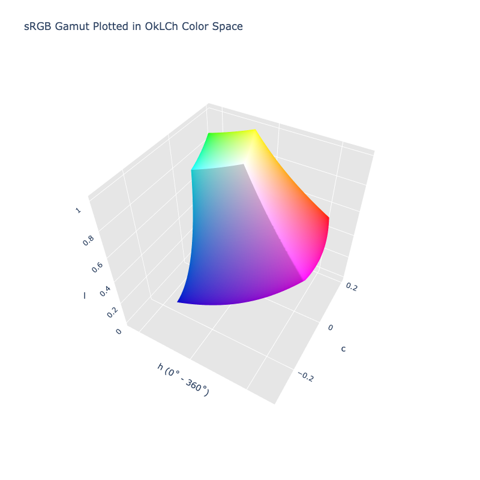

# OkLCh

/// success | The OkLCh color space is registered in `Color` by default
///

/// html | div.info-container
//// info | Properties
    attrs: {class: inline end}

**Name:** `oklch`

**White Point:** D65

**Coordinates:**

Name | Range^\*^
---- | ---------
`l`  | [0, 1]
`c`  | [0, 0.4]
`h`  | [0, 360)

^\*^ Space is not bound to the range and is only used as a reference to define percentage inputs/outputs in
relation to the Display P3 color space.
////

//// html | figure


///// html | figcaption
The sRGB gamut represented within the OkLCh color space.
/////
////


OkLCh is the cylindrical form of [Oklab](./oklab.md).

_[Learn about OkLCh](https://bottosson.github.io/posts/oklab/)_
///

## Channel Aliases

Channels | Aliases
-------- | -------
`l`      | `lightness`
`c`      | `chroma`
`h`      | `hue`

## Input/Output

Oklab is not currently supported in the CSS spec, the parsed input and string output formats use the
`#!css-color color()` function format using the custom name `#!css-color --oklch`:

```css-color
oklch(l c h / a)          // OkLCh function
color(--oklch l c h / a)  // Color function
```

The string representation of the color object will always default to the `#!css-color color(--oklch l c h / a)`
form, but the default string output will be the `#!css-color oklch(l a b / a)` form.

```py play
Color("oklch", [0.62796, 0.25768, 29.234])
Color("oklch", [0.79269, 0.17103, 70.67]).to_string()
Color("oklch", [0.96798, 0.21101, 109.77]).to_string(percent=True)
Color("oklch", [0.51975, 0.17686, 142.5]).to_string(color=True)
```

## Registering

```py
from coloraide import Color as Base
from coloraide.spaces.oklch import OkLCh

class Color(Base): ...

Color.register(OkLCh())
```
