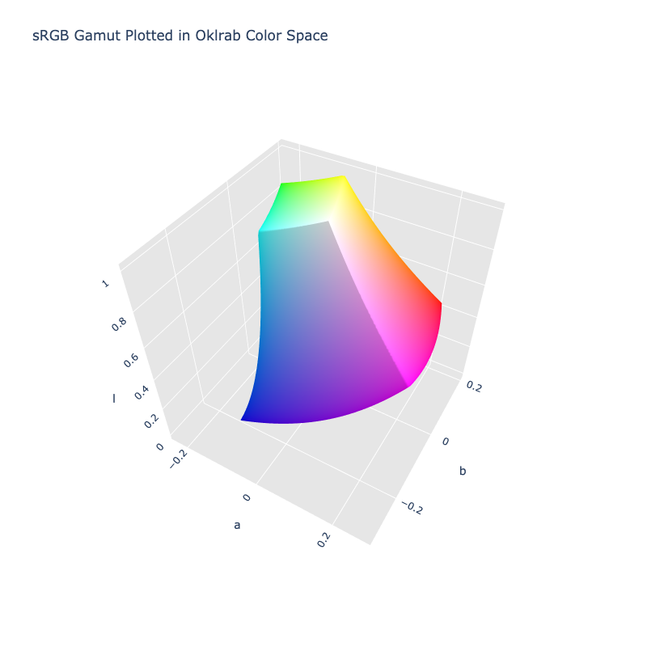

# Okl~r~ab

/// failure | The Okl~r~ab color space is not registered in `Color` by default
///

/// html | div.info-container
//// info | Properties
    attrs: {class: inline end}

**Name:** `oklrab`

**White Point:** D65 / 2˚

**Coordinates:**

Name | Range^\*^
---- | ---------
`l`  | [0, 1]
`a`  | [-0.4, 0.4]
`b`  | [-0.4, 0.4]

^\*^ Space is not bound to the range and is only used as a reference to define percentage inputs/outputs in
relation to the Display P3 color space.
////


//// figure-caption
The sRGB gamut represented within the Okl~r~ab color space.
////


Okl~r~ab is a variation of Oklab that adjusts the lightness estimate to more closely mach that of CIELab. This alternate
Oklab was designed as a trade-off for cases when a well defined reference white is desired, such as with Okhsl in color
picking.

_[Learn about Oklab](https://bottosson.github.io/posts/colorpicker/#intermission---a-new-lightness-estimate-for-oklab)_
///

## Channel Aliases

Channels | Aliases
-------- | -------
`l`      | `lightness`
`a`      |
`b`      |

## Input/Output

Okl~r~ab is not currently supported in the CSS spec, the parsed input and string output formats use the 
`#!css-color color()` function format using the custom name `#!css-color --oklrab`:

```css-color
color(--oklrab l a b / a)  // Color function
```

When manually creating a color via raw data or specifying a color space as a parameter in a function, the color
space name is always used:

```py
Color("oklrab", [0, 0, 0], 1)
```

The string representation of the color object and the default string output use the
`#!css-color color(--oklrab l a b / a)` form.

```py play
Color("oklrab", [0.56808, 0.22486, 0.12585])
Color("oklrab", [0.75883, 0.05661, 0.16138]).to_string()
Color("oklrab", [0.9627, -0.07137, 0.19857]).to_string(percent=True)
```

## Registering

```py
from coloraide import Color as Base
from coloraide.spaces.oklrab import Oklrab

class Color(Base): ...

Color.register(Oklrab())
```
