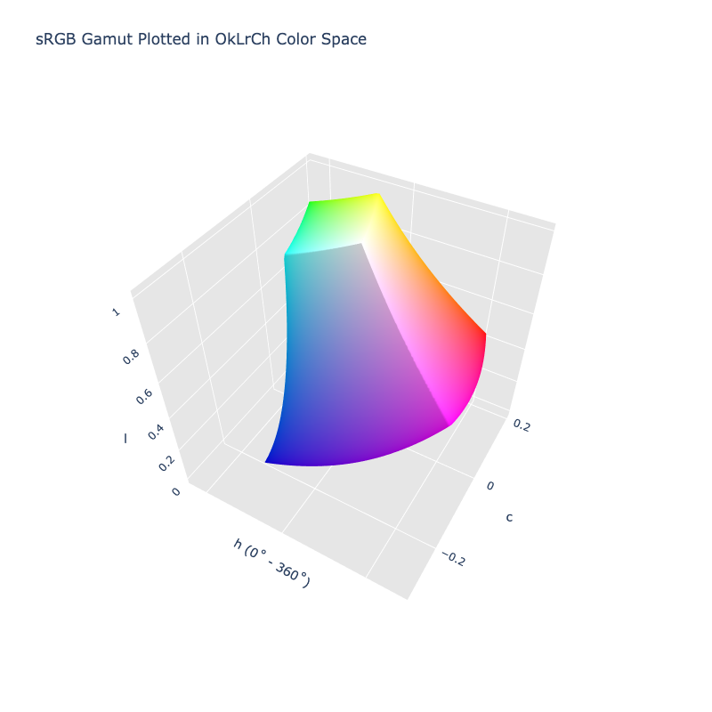

# OkL~r~Ch

/// failure | The OkL~r~Ch color space is not registered in `Color` by default
///

/// html | div.info-container
//// info | Properties
    attrs: {class: inline end}

**Name:** `oklrch`

**White Point:** D65 / 2˚ / 2˚

**Coordinates:**

Name | Range^\*^
---- | ---------
`l`  | [0, 1]
`c`  | [0, 0.4]
`h`  | [0, 360)

^\*^ Space is not bound to the range and is only used as a reference to define percentage inputs/outputs in
relation to the Display P3 color space.
////


//// figure-caption
The sRGB gamut represented within the OkL~r~Ch color space.
////


OkL~r~Ch is the polar form of [Okl~r~ab](./oklrab.md).

_[Learn about OkL~r~Ch](https://bottosson.github.io/posts/colorpicker/#intermission---a-new-lightness-estimate-for-oklab)_
///

## Channel Aliases

Channels | Aliases
-------- | -------
`l`      | `lightness`
`c`      | `chroma`
`h`      | `hue`

## Input/Output

OkL~r~Ch is not currently supported in the CSS spec, the parsed input and string output formats use the 
`#!css-color color()` function format using the custom name `#!css-color --oklrch`:

```css-color
color(--oklrch l a b / a)  // Color function
```

When manually creating a color via raw data or specifying a color space as a parameter in a function, the color
space name is always used:

```py
Color("oklrch", [0, 0, 0], 1)
```

The string representation of the color object and the default string output use the
`#!css-color color(--oklrch l c h / a)` form.

```py play
Color("oklrch", [0.56808, 0.25768, 29.234])
Color("oklrch", [0.75883, 0.17103, 70.67]).to_string()
Color("oklrch", [0.9627, 0.21101, 109.77]).to_string(percent=True)
```

## Registering

```py
from coloraide import Color as Base
from coloraide.spaces.oklrch import OkLrCh

class Color(Base): ...

Color.register(OkLrCh())
```
